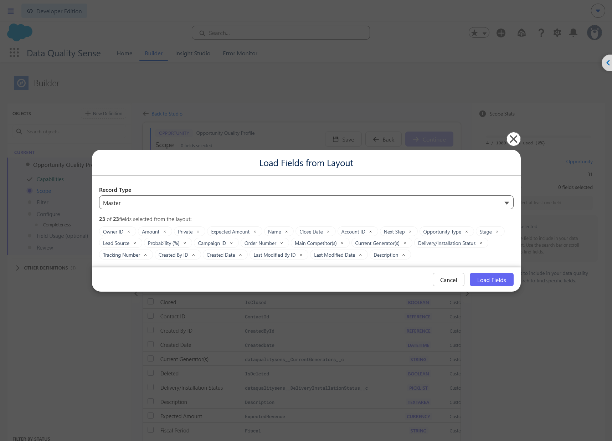
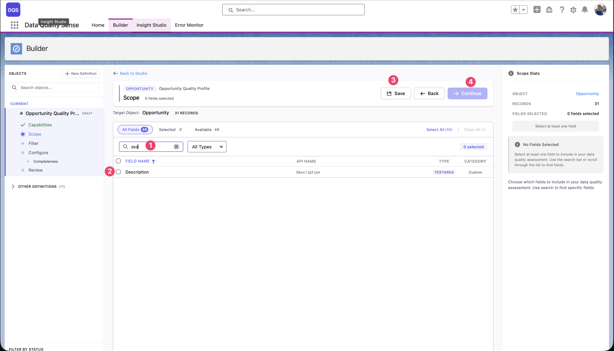
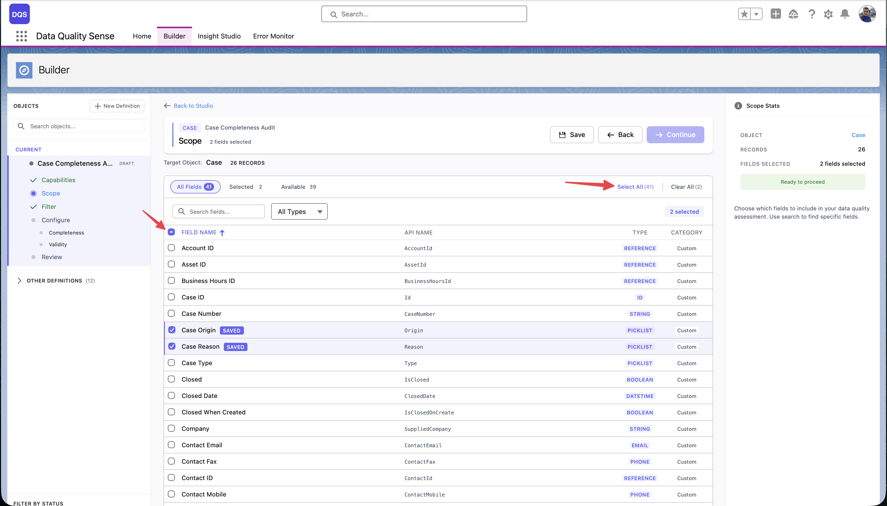
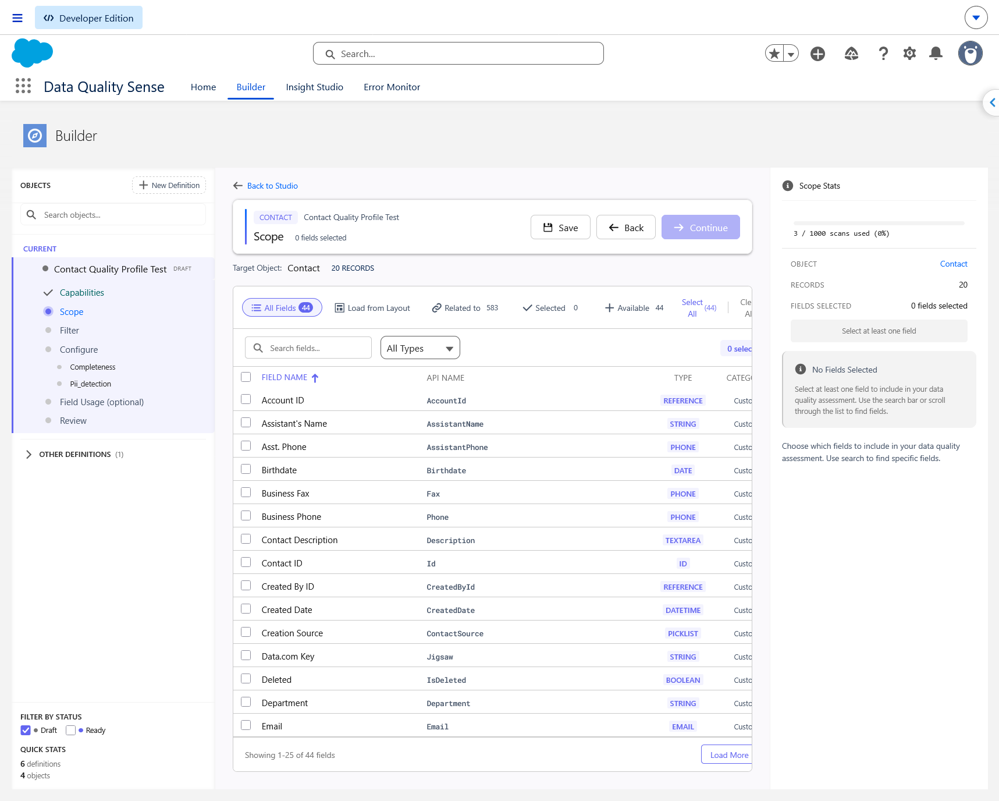

import { Aside } from '@astrojs/starlight/components';

## منتقي الحقول

منتقي الحقول هو المرحلة الثانية من معالج Builder. يعرض جميع الحقول المتاحة على الكائن المحدد في جدول مُرقّم الصفحات.

## الميزات

### تحميل الحقول من تخطيط

في خطوة **Scope** القابلة للتحرير، انقر على **Load from Layout** لفتح **Load Fields from Layout**. يكون الكائن محددًا وفق التعريف.

1. اختر **Record Type** (أو **Master**) لتحميل تخطيط الصفحة الكامل.
2. راجع قائمة الحقول وعددها. أزل الحقول غير المطلوبة باستخدام **×**، مع إبقاء حقل واحد على الأقل.
3. انقر على **Load Fields**. تُضاف الحقول المتاحة المطابقة إلى التحديد الحالي، مع الاحتفاظ بالتحديدات السابقة ودون إضافة مكررات.
4. راجع Scope وانقر على **Save** قبل المتابعة.

يُعيد تغيير Record Type تحميل التحديد ويعيد الحقول التي أزلتها في الحوار. ويمكنك لاحقًا إضافة الحقول أو إزالتها في Scope.

<Aside type="note">
يختار Record Type هنا التخطيط المراد قراءته ولا يقيّد السجلات المفحوصة. اضبط هذا القيد بصورة منفصلة في **Filter**. لا يفعّل الاستيراد إلى Scope ميزة Field Usage ولا يضيف الحقول إلى تحديد Field Usage محفوظ سابقًا.
</Aside>

### البحث والتصفية

- **البحث** — تصفية الحقول حسب التسمية أو اسم API
- **فلتر نوع الحقل** — عرض أنواع حقول محددة فقط (نص، رقم، قائمة منسدلة، إلخ.)
- **أعمدة قابلة للفرز** — الفرز حسب تسمية الحقل أو اسم API أو نوع الحقل

### معلومات الحقل

لكل حقل، يعرض المنتقي:

| العمود | الوصف |
|--------|-------|
| **التسمية** | اسم عرض الحقل |
| **اسم API** | اسم المطور (مثل `BillingCity`) |
| **النوع** | نوع بيانات الحقل (نص، رقم، تاريخ، قائمة منسدلة، إلخ.) |
| **مطلوب** | ما إذا كان الحقل مطلوبًا على التخطيط |

### الاختيار الجماعي

استخدم رابط **Select All** لإضافة جميع الحقول المتاحة إلى نطاقك دفعة واحدة — يعرض الرابط العدد الإجمالي للحقول (مثل "Select All (71)"). لإزالة جميع التحديدات، انقر على **Clear All**. يعرض شريط الرأس عدادات مباشرة لـ **المحدد** و **المتاح** حتى تعرف دائمًا عدد الحقول في النطاق.

تُحفظ التحديدات عبر الصفحات — يمكنك تحديد حقول في الصفحة 1، والانتقال إلى الصفحة 2، وتبقى تحديداتك محفوظة. تلخص لوحة **Scope Stats** على اليمين تحديدك الحالي.

## اعتبارات الحقول

<Aside type="tip">
ليست جميع أنواع الحقول قابلة للتطبيق على جميع القدرات. على سبيل المثال، قد لا يكون التفرّد ذا معنى للحقول المنطقية. يتعامل DQS تلقائيًا مع التركيبات غير القابلة للتطبيق.
</Aside>

### الحقول الموصى بها

للحصول على فحص شامل، قم بتضمين:
- **حقول المعرّفات الرئيسية** — الاسم، البريد الإلكتروني، الهاتف
- **حقول العناوين** — للاكتمال والصلاحية
- **حقول التاريخ** — للآنية
- **حقول القوائم المنسدلة** — للصلاحية والاتساق
- **حقول النص الحر** — للاكتمال وكشف البيانات الشخصية

### الحقول التي يجب تجنبها

- الحقول المُنشأة من النظام (Id، CreatedDate، LastModifiedDate) — هذه مُعبّأة دائمًا
- حقول الصيغ — يتم حساب قيمها وليس إدخالها من قبل المستخدمين
- الحقول المشفرة — قد لا تكون قابلة للقراءة بواسطة محرك الفحص

## عرض النطاق

عرض النطاق هو مساحة العمل الرئيسية لاختيار ومراجعة الحقول:

1. **خطوة النطاق** — انقر على خطوة **Scope** في الشريط الجانبي لمعالج Builder لتحميل جميع الحقول للكائن المستهدف. هذا هو المكان الذي تحدد فيه الحقول التي سيتم تضمينها في فحص جودة البيانات.

2. **جميع الحقول** — العرض الافتراضي يظهر كل حقل على الكائن. استخدم هذه العلامة لتصفح القائمة الكاملة، وتحديد أو إلغاء تحديد الحقول، ورؤية تسمية كل حقل واسم API ونوعه وما إذا كان حقلاً قياسيًا أو مخصصًا. يتم تمييز الحقول التي تحددها في القائمة.

3. **فلتر المحدد** — انتقل إلى هذا العرض لرؤية الحقول التي أضفتها بالفعل إلى النطاق فقط. يعرض العداد عدد الحقول المحددة (مثل "Selected: 2"). استخدمه لمراجعة خياراتك بسرعة وإزالة أي حقول لم تعد بحاجة إليها.

4. **فلتر المتاح** — يعرض فقط الحقول غير الموجودة في نطاقك بعد. يعرض العداد عدد الحقول المتبقية (مثل "Available: 16"). مفيد عندما تريد تصفح ما تبقى لإضافته دون التمرير عبر الحقول المحددة بالفعل.

5. **فلتر النوع** — تتيح لك القائمة المنسدلة **All Types** تضييق قائمة الحقول إلى نوع بيانات محدد — نص، رقم، تاريخ، قائمة منسدلة، منطقي، بحث، والمزيد. ادمجه مع الفلاتر الأخرى للعثور بسرعة على الحقول الدقيقة التي تحتاجها (مثل عرض حقول القوائم المنسدلة المتاحة فقط).

تلخص لوحة **Scope Stats** على اليمين تحديدك بعدد الحقول وتعرض مؤشر **جاهز للمتابعة** عند تحديد حقل واحد على الأقل.

