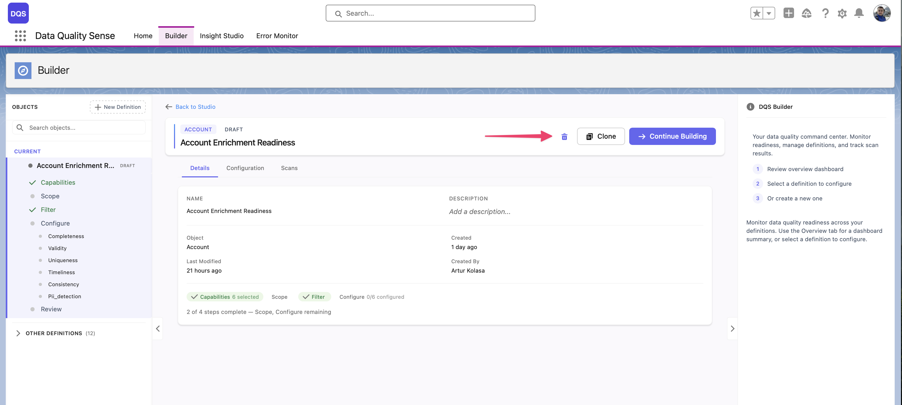
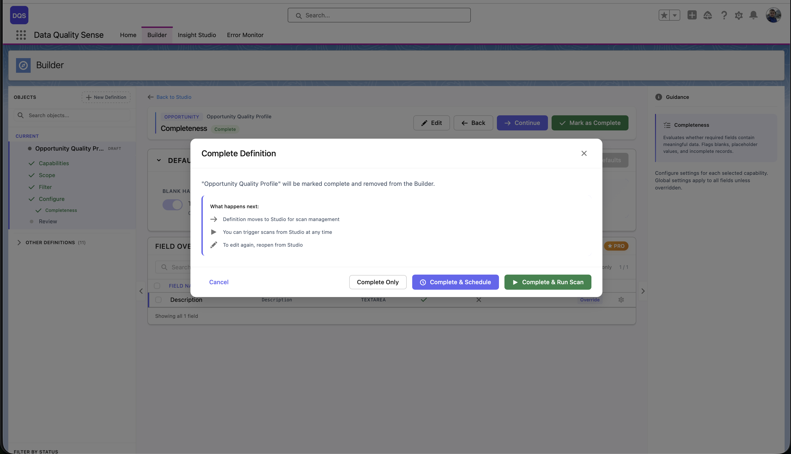

import { Aside } from '@astrojs/starlight/components';

## مراحل دورة الحياة

يتقدم كل تعريف فحص عبر سلسلة من المراحل:

```
Draft  →  Ready  →  Active  →  Obsolete
```

### المسودة (Draft)

الحالة الأولية عند إنشاء التعريف. في حالة المسودة:
- يمكن تعديل التعريف بحرية
- يمكن إضافة أو إزالة الحقول والقدرات
- لا يمكن تنفيذ أي عمليات فحص
- التعريف غير مرئي في Insight Studio

### جاهز (Ready)

حالة انتقالية تشير إلى أن التعريف قد تمت مراجعته. في حالة جاهز:
- جميع التكوينات المطلوبة مكتملة
- اجتاز التعريف عملية التحقق
- يمكن تفعيله

### نشط (Active)

الحالة التشغيلية. في الحالة النشطة:
- يمكن تنفيذ عمليات الفحص وفقًا للتعريف
- تظهر النتائج في Insight Studio
- يمكن جدولة التعريف لعمليات فحص متكررة
- لا يزال التعديل ممكنًا — تسري التغييرات في الفحص التالي

### متقاعد (Obsolete)

الحالة المتقاعدة. في حالة التقاعد:
- لا يمكن تشغيل عمليات فحص جديدة
- تبقى النتائج الموجودة مرئية في Insight Studio للتحليل التاريخي
- يمكن إعادة تفعيل التعريف عند الحاجة



## التحقق من التفعيل

قبل تفعيل التعريف، يتحقق DQS من:

| القاعدة | الوصف |
|---------|-------|
| **حقول محددة** | يجب تحديد حقل واحد على الأقل |
| **قدرات مُفعّلة** | يجب تفعيل قدرة واحدة على الأقل |
| **اكتمال التكوين** | يجب ملء جميع إعدادات القدرات المطلوبة |

<Aside type="note">
عند النقر على **Activate**، ينتقل التعريف مباشرة إلى الحالة النشطة. تُستخدم حالة جاهز داخليًا لبوابة التحقق.
</Aside>

## تغيير الحالة

- **مسودة → نشط**: انقر على "Mark as Complete" على شاشة الملخص — اختر بين Complete Only أو Complete & Schedule أو Complete & Run Scan
- **نشط → متقاعد**: استخدم إعدادات التعريف لإحالته للتقاعد
- **متقاعد → نشط**: أعد التفعيل من إعدادات التعريف


