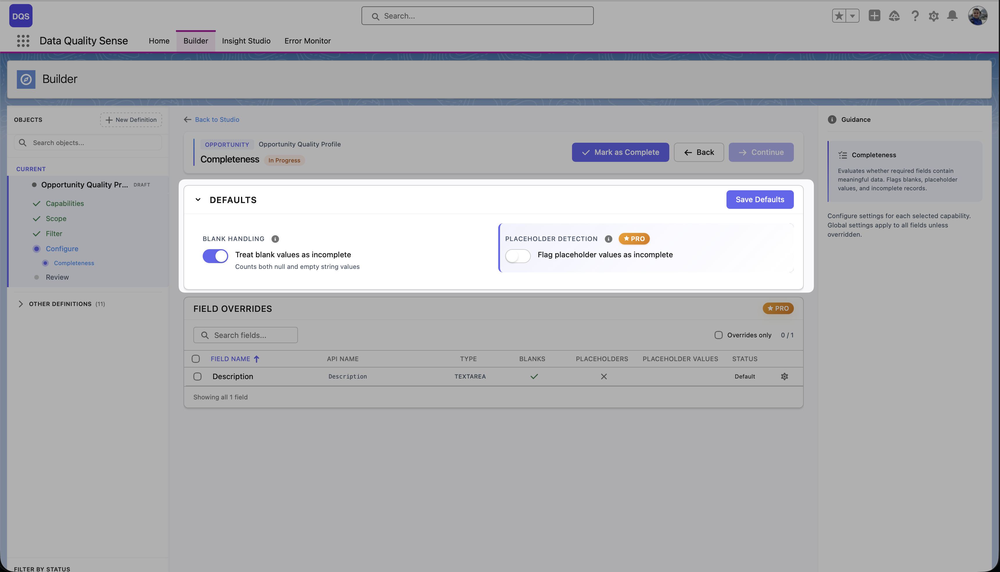
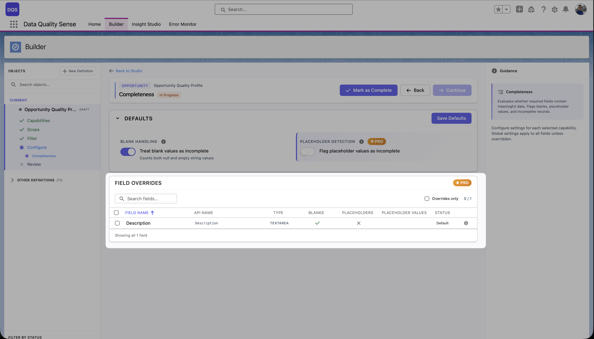

import { Aside } from '@astrojs/starlight/components';

## What is Completeness?

Completeness measures the **fill rate** of your fields — the percentage of records where a field contains a non-null, non-blank value.

## How It Works

For each field included in the scan, the Completeness strategy:

1. Counts the total number of records in scope
2. Counts how many records have a non-empty value for that field
3. Calculates the fill rate: `(populated records / total records) × 100`

## Configuration

### Global Settings

| Setting | Description | Default |
|---------|-------------|---------|
| **Expected Fill Rate** | The minimum acceptable percentage of populated records | 80% |

### Per-Field Overrides

Override the expected fill rate for individual fields. Common overrides:
- **Required fields** (Email, Name) → 100%
- **Optional fields** (Description, Notes) → 50%
- **Rarely used fields** → 20%

## Scoring

| Fill Rate | Score |
|-----------|-------|
| ≥ Expected | 100 |
| Below expected | Proportional (e.g., 70% fill with 80% target = 87.5 score) |
| 0% | 0 |

<Aside type="note">
A score of 0 means the denominator was zero (no records to measure), not that all fields are empty.
</Aside>

## Use Cases

- Identify fields that are frequently left blank by sales reps
- Monitor data entry compliance for required fields
- Track completeness trends over time after data quality initiatives
- Ensure critical fields (Email, Phone) are consistently populated

## Bulk Configuration

Use the **Bulk Config** option to set the same fill rate override across multiple fields at once — useful when you have many fields that share the same completeness requirement.
