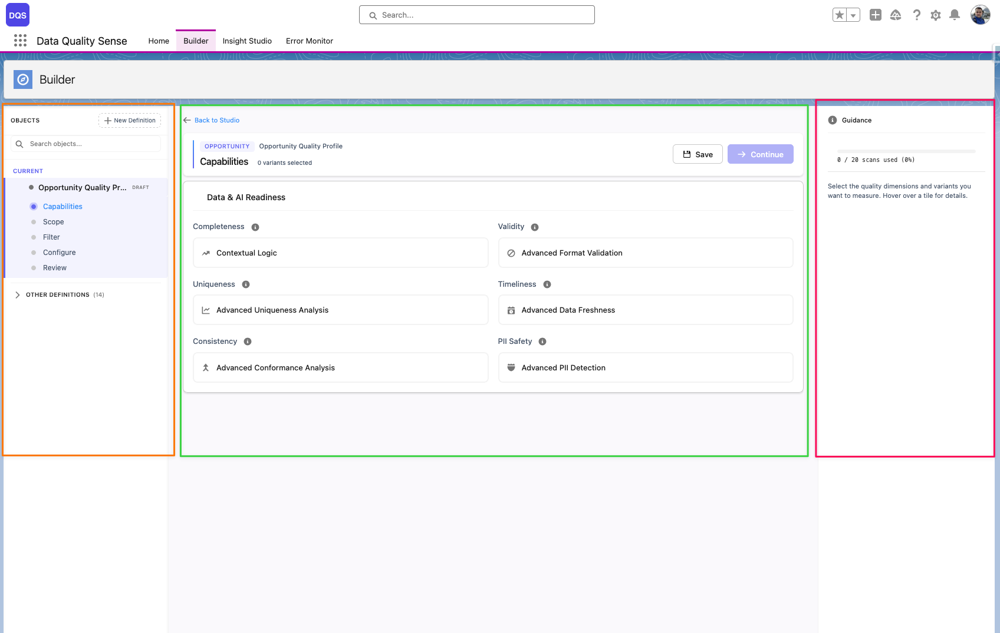

import { Card, CardGrid } from '@astrojs/starlight/components';

## Was ist der Builder?

Der DQS Builder ist ein **mehrstufiger Konfigurationsassistent**, mit dem Sie genau festlegen können, wie Ihre Datenqualität gemessen werden soll. Er führt Sie durch die Auswahl von Objekten, die Auswahl von Feldern, die Wahl der Qualitätsdimensionen und die Festlegung von Schwellenwerten.

## Builder-Arbeitsbereich

Der Builder verwendet ein **3-Zonen-Layout**:

- **Seitenleiste** (orange) — Navigationsbaum mit Ihren Definitionen und deren Konfigurationsstufen (Capabilities, Scope, Fields, Configure, Review)
- **Stage** (grün) — Hauptinhaltsbereich, in dem Sie jeden Schritt der Definition konfigurieren
- **Guidance-Panel** (rot) — Kontexthilfe und Anleitung, die sich an Ihren aktuellen Schritt anpasst

## Schlüsselkonzepte

<CardGrid>
	<Card title="Definition" icon="document">
		Eine Scan-Konfiguration, die festlegt, welches Objekt, welche Felder und welche Qualitäts-Capabilities bewertet werden sollen. Jede Definition erzeugt bei einem Scan eine Reihe von Ergebnissen.
	</Card>
	<Card title="Capability" icon="approve-check-circle">
		Eine Qualitätsdimension wie Completeness oder Validity. Jede Capability kann global konfiguriert oder pro Feld überschrieben werden.
	</Card>
	<Card title="Definition Detail" icon="list-format">
		Ein Datensatz, der ein bestimmtes Feld mit einer Definition verknüpft und feldspezifische Konfigurationsüberschreibungen für jede Capability speichert.
	</Card>
	<Card title="Lebenszyklus" icon="setting">
		Definitionen durchlaufen Stufen: Draft → Ready → Active → Obsolete. Nur aktive Definitionen können gescannt werden.
	</Card>
</CardGrid>

## Builder-Stufen

1. **Erste Schritte** — Ziel-Salesforce-Objekt auswählen
2. **Feldauswahl** — Felder für den Scan auswählen
3. **Capability-Konfiguration** — Qualitätsdimensionen aktivieren und konfigurieren
4. **Zusammenfassung** — Vollständige Definition vor der Aktivierung überprüfen

Jede Stufe validiert Ihre Eingaben, bevor Sie zum nächsten Schritt übergehen können.

## Mehr erfahren

- [Definition erstellen](/de/builder/creating-definition/)
- [Feldauswahl](/de/builder/field-selection/)
- [Capabilities konfigurieren](/de/builder/capabilities/)
- [Definitions-Lebenszyklus](/de/builder/lifecycle/)
