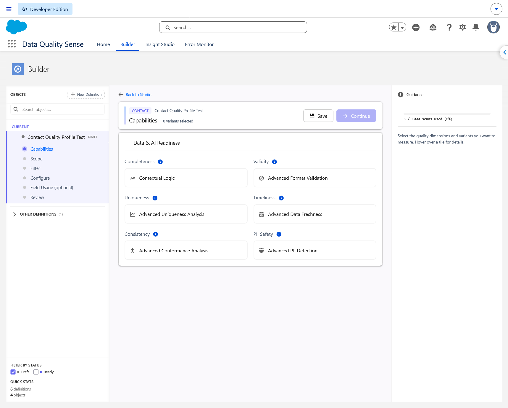

import { Card, CardGrid } from '@astrojs/starlight/components';

## Was ist der Builder?

Der DQS Builder ist ein **mehrstufiger Konfigurationsassistent**, mit dem Sie genau festlegen können, wie Ihre Datenqualität gemessen werden soll. Er führt Sie durch die Auswahl von Objekten, die Auswahl von Feldern, die Wahl der Qualitätsdimensionen und die Festlegung von Schwellenwerten.

## Builder-Arbeitsbereich

Der Builder verwendet ein **3-Zonen-Layout**:

- **Seitenleiste** — Navigationsbaum mit Ihren Definitionen und deren Konfigurationsstufen (Capabilities, Scope, Filter, Configure, Field Usage, Review)
- **Stage** — Hauptinhaltsbereich, in dem Sie jeden Schritt der Definition konfigurieren
- **Guidance-Panel** — Kontexthilfe und Anleitung, die sich an Ihren aktuellen Schritt anpasst

## Schlüsselkonzepte

<CardGrid>
	<Card title="Definition" icon="document">
		Eine Scan-Konfiguration, die festlegt, welches Objekt, welche Felder und welche Qualitäts-Capabilities bewertet werden sollen. Jede Definition erzeugt bei einem Scan eine Reihe von Ergebnissen.
	</Card>
	<Card title="Capability" icon="approve-check-circle">
		Eine Qualitätsdimension wie Completeness oder Validity. Jede Capability kann global konfiguriert oder pro Feld überschrieben werden.
	</Card>
	<Card title="Definition Detail" icon="list-format">
		Ein Datensatz, der ein bestimmtes Feld mit einer Definition verknüpft und feldspezifische Konfigurationsüberschreibungen für jede Capability speichert.
	</Card>
	<Card title="Lebenszyklus" icon="setting">
		Definitionen durchlaufen Stufen: Draft → Ready → Active → Obsolete. Nur aktive Definitionen können gescannt werden.
	</Card>
</CardGrid>

## Builder-Stufen

1. **Capabilities** — Qualitätsdimensionen auswählen.
2. **Scope** — Die zu bewertenden Felder speichern.
3. **Filter** — Datensatzfilter festlegen oder bestätigen, dass kein Filter benötigt wird.
4. **Configure** — Capabilities konfigurieren und ihre Einstellungen mit **Confirm Configuration** bestätigen.
5. **Field Usage (optional)** — Optional Metadaten-Nutzungsberichte aktivieren und die Feldauswahl speichern.
6. **Review** — Die Definition prüfen und abschließen.

Vor dem Abschluss muss die erforderliche Konfiguration vollständig sein. Field Usage ist optional und standardmäßig deaktiviert; Qualitätsscans bleiben davon unabhängig. Nach Configure öffnet **Continue** Field Usage. Speichern Sie Änderungen vor dem Fortfahren oder vor **Mark as Complete**, das in Field Usage und Review verfügbar ist.

## Mehr erfahren

- [Definition erstellen](/de/builder/creating-definition/)
- [Feldauswahl](/de/builder/field-selection/)
- [Capabilities konfigurieren](/de/builder/capabilities/)
- [Definitions-Lebenszyklus](/de/builder/lifecycle/)
- [Field Usage](/de/insight-studio/field-usage/)
