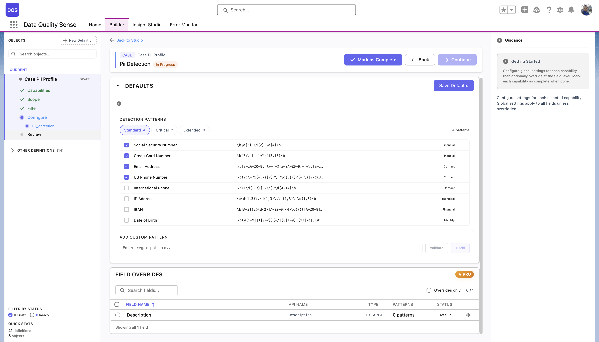
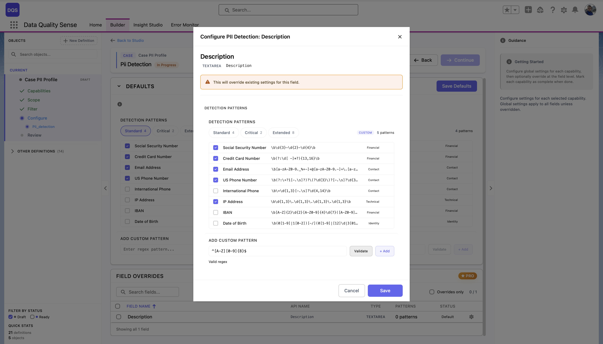

import { Aside } from '@astrojs/starlight/components';

## Was ist PII Detection?

PII Detection scannt Freitextfelder nach **personenbezogenen Daten**, die nicht in diesen Feldern gespeichert werden sollten. Es hilft Organisationen bei der Einhaltung von Datenschutzvorschriften wie DSGVO, CCPA und HIPAA.

## Funktionsweise

Die PII Detection-Strategie analysiert Textinhalte auf Muster, die übereinstimmen mit:

1. **Social Security Numbers** (SSN) — numerische Muster wie XXX-XX-XXXX
2. **Kreditkartennummern** — 13–19-stellige Sequenzen, die Kartennetzwerk-Mustern entsprechen
3. **E-Mail-Adressen** — in Feldern, in denen keine E-Mail-Speicherung erwartet wird
4. **Telefonnummern** — in Freitextfeldern (nicht in dedizierten Telefonfeldern)
5. **Nationale ID-Nummern** — länderspezifische Muster

## Konfiguration

### Erkennungsmuster

Der Abschnitt **Defaults** bietet drei voreingestellte Gruppen von Erkennungsmustern:

| Voreinstellung | Beschreibung |
|---------------|-------------|
| **Standard** | Kern-PII-Muster — Social Security Number, Credit Card Number, Email Address, US Phone Number |
| **Critical** | Hochrisiko-Finanz- und Identitätsmuster |
| **Extended** | Vollständiger Satz einschließlich IP Address, IBAN, Date of Birth, International Phone und mehr |

Jedes Muster zeigt seinen Regex-Ausdruck und kann einzeln aktiviert oder deaktiviert werden. Sie können auch eigene Muster im Abschnitt **Add Custom Pattern** hinzufügen, indem Sie einen Regex und eine Bezeichnung eingeben.

### Feldspezifische Überschreibungen

Klicken Sie auf ein Feld in der Field Overrides-Tabelle, um dessen Konfigurationsmodal zu öffnen. Sie können auswählen, welche Erkennungsmuster für dieses Feld gelten — wählen Sie eine Voreinstellung oder aktivieren/deaktivieren Sie einzelne Muster. Das Modal ermöglicht es Ihnen auch, **benutzerdefinierte Muster** speziell für dieses Feld hinzuzufügen. Verwenden Sie den Link **Revert to Global** zum Zurücksetzen.

## Bewertung

| Ergebnis | Bewertung |
|----------|-----------|
| Keine PII erkannt | 100 |
| Einige PII gefunden | Proportional zum Prozentsatz sauberer Datensätze |
| PII in allen Datensätzen | 0 |
| Keine Daten | 0 |

<Aside type="caution">
PII Detection verwendet Musterabgleich, keine KI-Klassifikation. Es kann falsch positive Ergebnisse produzieren (z. B. eine Nummer, die wie eine SSN aussieht, aber keine ist). Überprüfen Sie markierte Datensätze, bevor Sie Maßnahmen ergreifen.
</Aside>

## PII-Regex-Muster

DQS verwendet **Java-kompatible reguläre Ausdrücke** zur Erkennung von PII in Freitextfeldern. Siehe den [Regex-Tester](/de/reference/regex-tester/) für einen interaktiven Tester und eine vollständige Bibliothek von PII-Mustern — einschließlich SSN, Kreditkarten (Visa, Mastercard, Amex), IBAN, Passnummern, PESEL, NIP und mehr.

## Anwendungsfälle

- Description- und Notes-Felder auf versehentlich gespeicherte Kreditkartennummern prüfen
- Freitextfelder auf Social Security Numbers überwachen
- Compliance-Berichterstattung für Datenschutzvorschriften
- Datenbereinigung vor Migration
