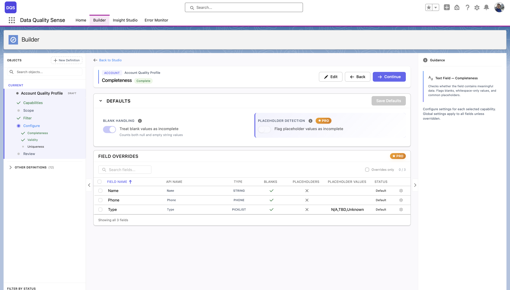

import { Aside } from '@astrojs/starlight/components';

## ¿Qué es Completeness?

Completeness mide la **tasa de llenado** de sus campos — el porcentaje de registros donde un campo contiene un valor no nulo y no vacío.

## Cómo funciona

Para cada campo incluido en el escaneo, la estrategia de Completeness:

1. Cuenta el número total de registros en el alcance
2. Cuenta cuántos registros tienen un valor no vacío para ese campo
3. Calcula la tasa de llenado: `(registros rellenados / total de registros) × 100`

## Configuración

### Ajustes globales

| Ajuste | Descripción | Predeterminado |
|--------|-------------|----------------|
| **Expected Fill Rate** | El porcentaje mínimo aceptable de registros rellenados | 80% |

### Personalizaciones por campo

Personalice la tasa de llenado esperada para campos individuales. Personalizaciones comunes:
- **Campos obligatorios** (Email, Name) → 100%
- **Campos opcionales** (Description, Notes) → 50%
- **Campos poco utilizados** → 20%

## Puntuación

| Tasa de llenado | Puntuación |
|-----------------|------------|
| ≥ Esperada | 100 |
| Por debajo de lo esperado | Proporcional (por ejemplo, 70% de llenado con objetivo del 80% = puntuación de 87.5) |
| 0% | 0 |

<Aside type="note">
Una puntuación de 0 significa que el denominador era cero (sin registros para medir), no que todos los campos están vacíos.
</Aside>

## Casos de uso

- Identificar campos que los representantes de ventas dejan en blanco con frecuencia
- Monitorear el cumplimiento de la entrada de datos para campos obligatorios
- Rastrear tendencias de completitud a lo largo del tiempo después de iniciativas de calidad de datos
- Asegurar que campos críticos (Email, Phone) estén consistentemente rellenados

## Configuración masiva

Use la opción **Bulk Config** para establecer la misma personalización de tasa de llenado en múltiples campos a la vez — útil cuando tiene muchos campos que comparten el mismo requisito de completitud.

