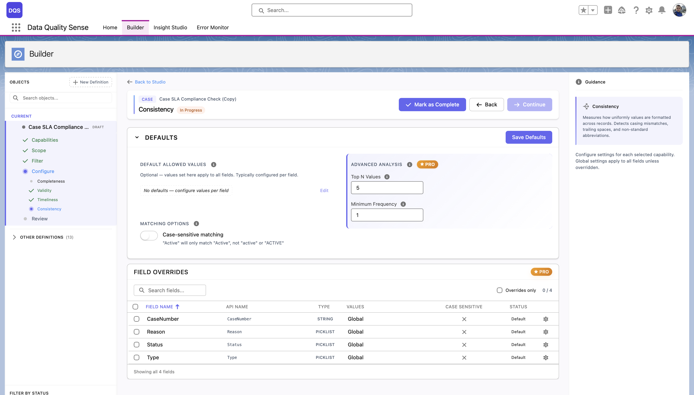
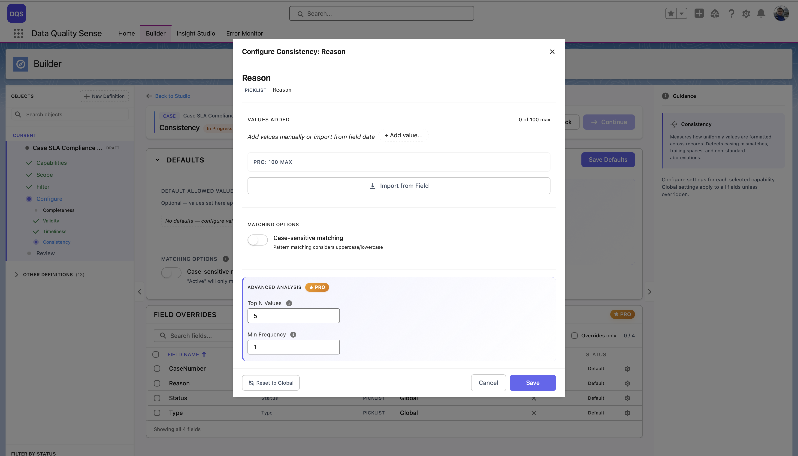
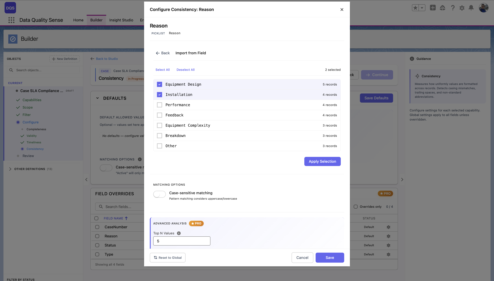

## ¿Qué es Consistency?

Consistency mide si **los campos relacionados contienen valores lógicamente compatibles**. Los datos pueden ser completos y válidos individualmente, pero aún ser inconsistentes cuando los campos se contradicen entre sí.

## Cómo funciona

La estrategia de Consistency evalúa relaciones entre pares o grupos de campos:

1. Identifica las reglas de consistencia configuradas (relaciones entre campos)
2. Para cada registro, verifica si los campos relacionados satisfacen la regla
3. Calcula el porcentaje de registros que pasan todas las verificaciones de consistencia

## Configuración

### Ajustes globales

La sección **Defaults** controla las opciones globales de consistencia:

| Ajuste | Descripción |
|--------|-------------|
| **Default Allowed Values** | No se establecen valores predeterminados globalmente — configure los valores permitidos por campo para definir qué se considera consistente. |
| **Case-sensitive matching** | Cuando está habilitado, "Active" y "active" se tratan como valores diferentes. Deshabilitado por defecto. |
| **Top N Values** | *(PRO)* Analizar solo los N valores más frecuentes para las verificaciones de consistencia. |
| **Minimum Frequency** | *(PRO)* Ignorar valores que aparecen menos veces que este umbral. |

La tabla **Field Overrides** lista cada campo con su fuente de valores permitidos actual, ajuste de sensibilidad a mayúsculas y estado.

### Personalizaciones por campo

Haga clic en un campo en la tabla de Field Overrides para abrir su modal de configuración. Puede definir **valores permitidos** para ese campo agregándolos manualmente o importándolos desde los metadatos del campo. Alterne **Case-sensitive matching** y configure los ajustes de **Advanced Analysis** (Top N Values, Min Frequency) independientemente de los valores predeterminados globales. Use el enlace **Revert to Global** para restablecer.

### Importar desde campo

Para campos de lista de selección, haga clic en **Import from Field** para cargar todos los valores existentes directamente desde los metadatos del campo. El diálogo de importación muestra cada valor con una casilla de verificación y el número de registros que lo usan, para que pueda seleccionar qué valores tratar como válidos. Haga clic en **Apply Selection** para confirmar.

## Puntuación

| Resultado | Puntuación |
|-----------|------------|
| Todos los registros consistentes | 100 |
| Algunas inconsistencias | Proporcional al porcentaje de consistentes |
| Todos los registros inconsistentes | 0 |
| Sin datos | 0 |

## Casos de uso

- Detectar oportunidades donde la fecha de cierre es anterior a la fecha de creación
- Encontrar cuentas donde las direcciones de facturación y envío se contradicen
- Identificar leads donde el país no coincide con el formato del número de teléfono
- Monitorear la calidad de entrada de datos entre campos
