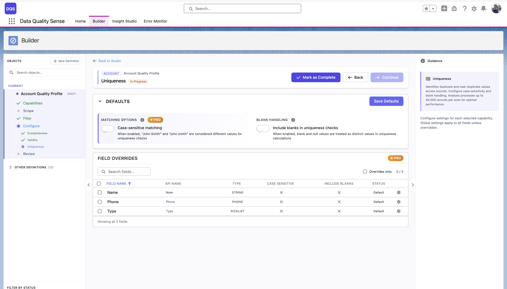
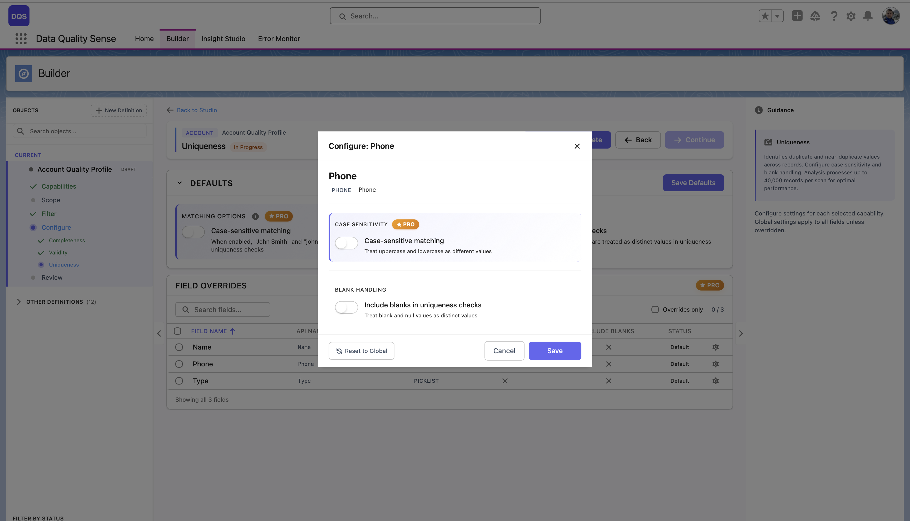

## ¿Qué es Uniqueness?

Uniqueness mide si los valores de los campos son **distintos entre registros**. Una alta unicidad significa que cada registro tiene un valor diferente para el campo — una baja unicidad indica duplicados.

## Cómo funciona

Para cada campo, la estrategia de Uniqueness:

1. Recopila todos los valores no nulos entre los registros en el alcance
2. Identifica valores duplicados
3. Calcula: `(valores únicos / total de valores rellenados) × 100`

## Configuración

### Ajustes globales

La sección **Defaults** controla las opciones globales de unicidad:

| Ajuste | Descripción |
|--------|-------------|
| **Case-sensitive matching** | Cuando está habilitado, "John Smith" y "john smith" se consideran valores diferentes para la comparación. Cuando está deshabilitado, se cuentan como duplicados. |
| **Include blanks in uniqueness checks** | Cuando está habilitado, los valores vacíos y nulos se tratan como valores distintos en los cálculos de comparación. |

La tabla **Field Overrides** debajo lista cada campo con sus ajustes actuales de Case Sensitive, Include Blanks y estado.

### Personalizaciones por campo

Haga clic en un campo en la tabla de Field Overrides para abrir su modal de configuración. Puede alternar **Case-sensitive matching** e **Include blanks in uniqueness checks** independientemente de los valores predeterminados globales. Use el enlace **Revert to Global** para restablecer el campo a los ajustes globales.

## Puntuación

| Resultado | Puntuación |
|-----------|------------|
| Todos los valores únicos | 100 |
| Algunos duplicados | Proporcional al porcentaje de únicos |
| Todos los valores idénticos | Cercano a 0 |
| Sin datos | 0 |

## Límite de análisis

El análisis de unicidad procesa hasta **40,000 registros por escaneo**. Para objetos con más registros, los resultados reflejan una muestra representativa. Este límite existe para prevenir el desbordamiento de memoria heap de Salesforce, ya que el motor construye un mapa en memoria de conteos de valores por campo. Los campos que exceden 40,000 valores distintos se marcan como campos de alta cardinalidad.

## Tipos de campo aplicables

Uniqueness es más significativo para:
- **Email** — debe ser único por contacto/lead
- **Phone** — generalmente único por persona
- **External IDs** — deben ser únicos por definición
- **Campos de texto** — nombres, descripciones

Menos significativo para:
- **Boolean** — solo dos valores posibles
- **Picklist** — conjunto limitado de valores por diseño
- **Date** — muchos registros pueden compartir fechas

## Casos de uso

- Detectar direcciones de email duplicadas entre Contacts o Leads
- Verificar que los campos de external ID sean verdaderamente únicos
- Identificar problemas de entrada de datos donde el mismo valor se copia entre registros
- Monitorear esfuerzos de deduplicación a lo largo del tiempo
