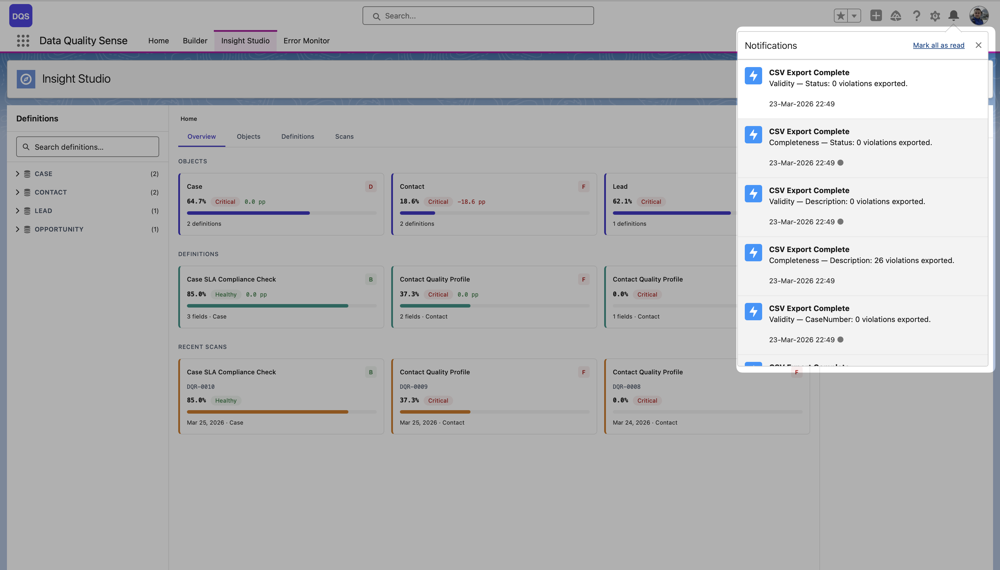
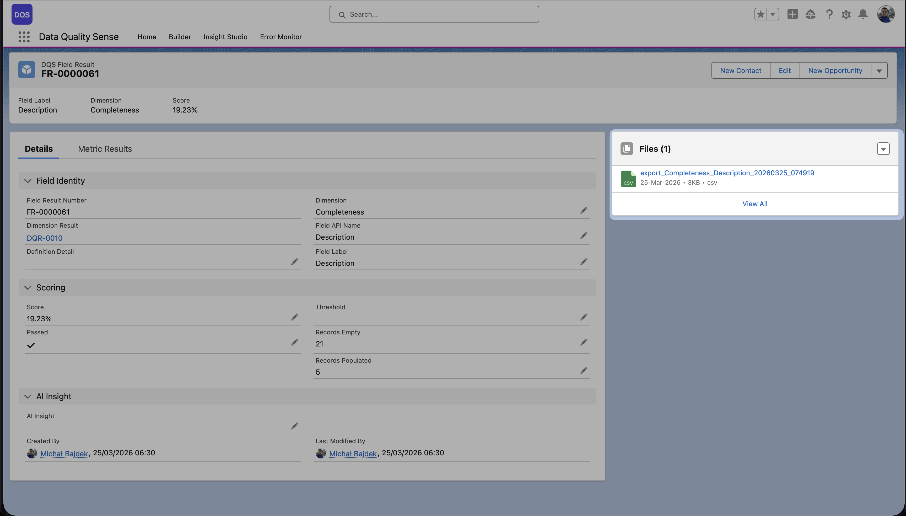
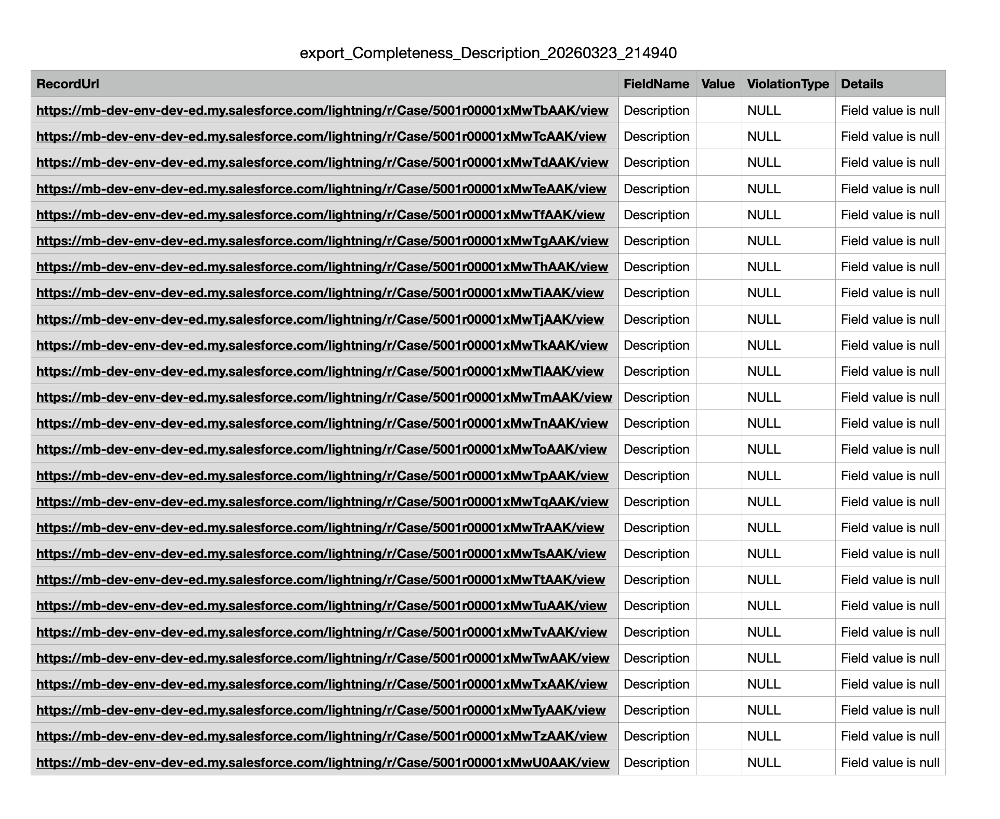

## Exportación a CSV

Insight Studio soporta la **exportación a CSV** de detalles de violaciones para todas las dimensiones. Esto le permite tomar acción sobre problemas de calidad de datos fuera de Salesforce.

## Qué se exporta

Cada exportación contiene los registros específicos que no pasaron las verificaciones de calidad para una dimensión determinada:

| Dimensión | La exportación contiene |
|-----------|------------------------|
| **Completeness** | Registros con campos vacíos/nulos |
| **Validity** | Registros con valores inválidos |
| **Uniqueness** | Registros con valores duplicados |
| **Timeliness** | Registros con fechas obsoletas |
| **Consistency** | Registros con campos contradictorios |
| **PII Detection** | Registros con PII detectado |

## Columnas de exportación

Cada CSV incluye:
- **Record ID** — Identificador del registro de Salesforce
- **Record Name** — Nombre de visualización del registro
- **Field** — El campo que no pasó la verificación
- **Current Value** — El valor que activó la violación
- **Violation Type** — Tipo específico de problema de calidad
- **Score** — La puntuación del campo para esta dimensión

## Cómo exportar

1. Navegue a la vista de dimensión o campo en Insight Studio
2. Haga clic en el botón **Export**
3. La exportación se ejecuta como un proceso en segundo plano — recibe una **notificación personalizada** en el icono de campana cuando se completa. Cada notificación muestra la dimensión, campo y número de violaciones exportadas (por ejemplo, "Validity — Status: 0 violations exported")
4. Haga clic en la notificación para navegar a la página de **Field Result** en Salesforce, donde el CSV está adjunto en el panel **Files**

<video src="/videos/export-csv.mp4" controls muted loop style="width:100%;border-radius:0.5rem;border:1px solid var(--sl-color-hairline-light)">Su navegador no soporta la etiqueta de video.</video>

La página de Field Result muestra el contexto completo — identidad del campo, dimensión, detalles de puntuación (puntuación, umbral, registros vacíos/rellenados) y una sección de **AI Insight**. El archivo CSV exportado está disponible para descarga en el panel **Files** a la derecha.

A continuación se muestra un ejemplo del contenido del archivo CSV exportado:

## Casos de uso

- Compartir informes de calidad de datos con partes interesadas que no tienen acceso a Salesforce
- Importar listas de violaciones en herramientas de limpieza de datos
- Crear elementos de acción en herramientas de gestión de proyectos
- Documentación de cumplimiento y registros de auditoría
