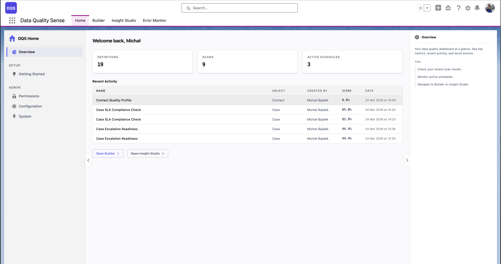
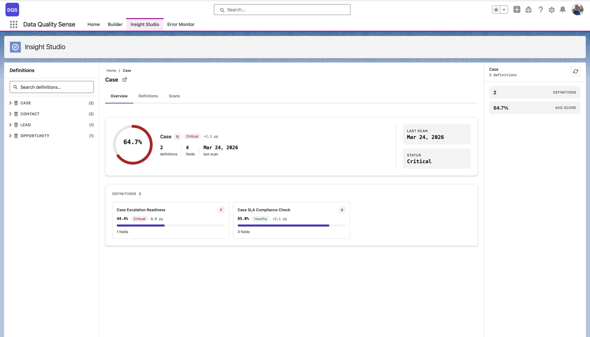
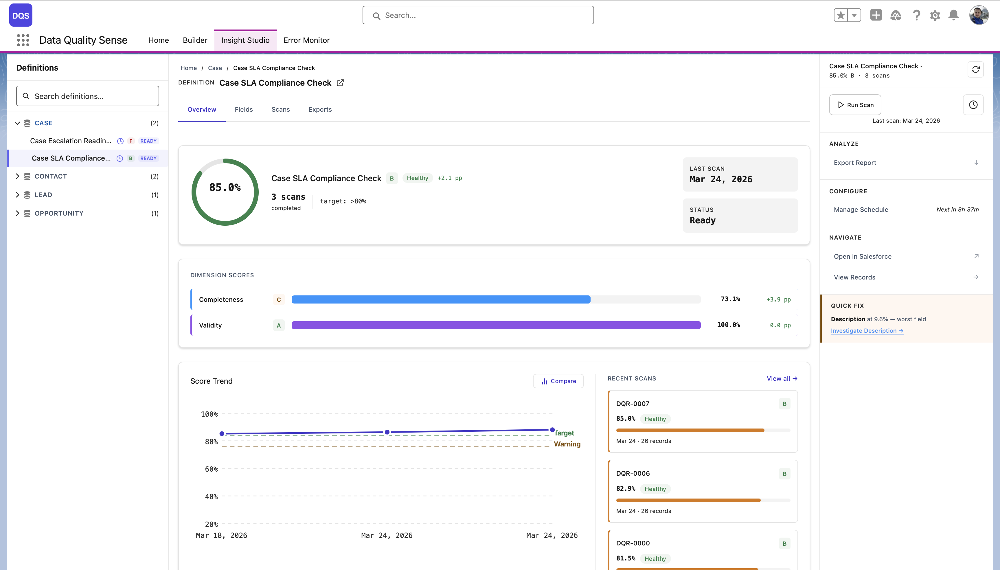
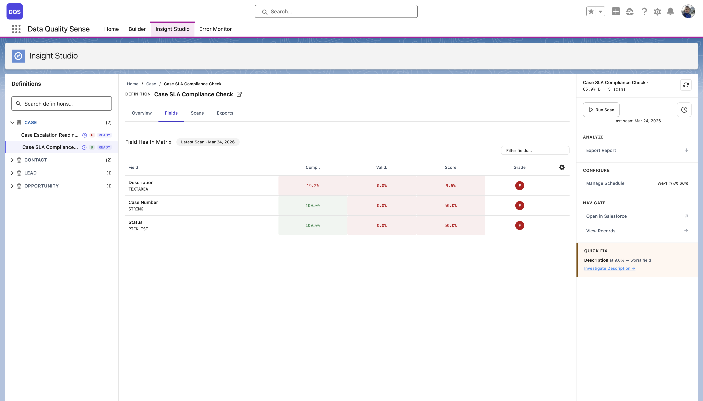
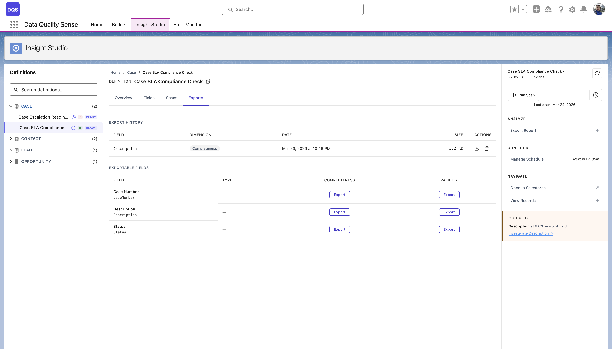
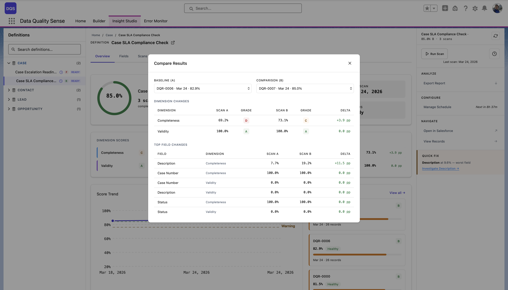
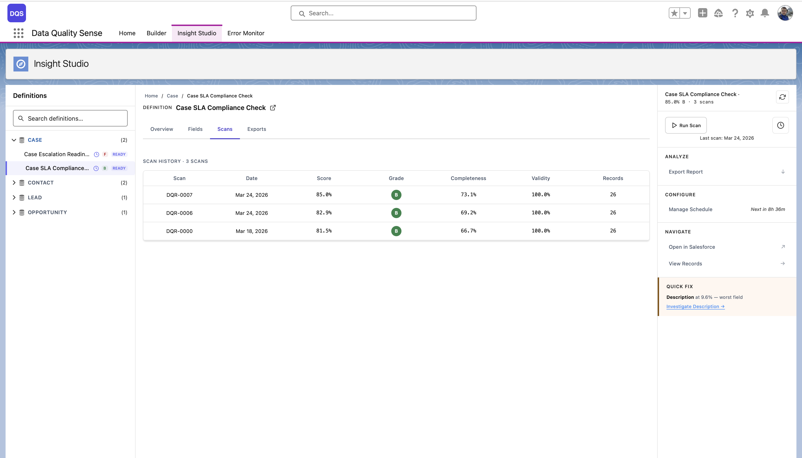
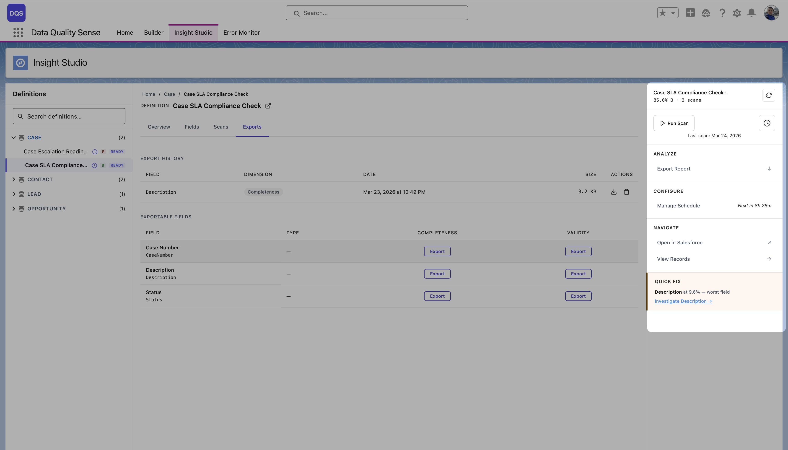
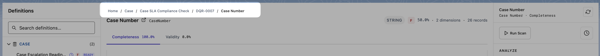

## Profundidad de navegación

Insight Studio proporciona una jerarquía de **6 niveles de profundización**:

```
Home → Object → Definition → Scan → Field → Dimension
```

### Nivel 1: Home

La vista de nivel superior que muestra todos los objetos escaneados con sus puntuaciones de calidad más recientes. Úsela para identificar qué objetos necesitan atención.



### Nivel 2: Object

Muestra todas las definiciones de un objeto seleccionado con la puntuación de calidad general, fecha del último escaneo, estado y tarjetas de definición. Compare diferentes configuraciones de escaneo y sus resultados lado a lado.



### Nivel 3: Definition

El panel principal para una definición individual. Tiene cuatro pestañas:

- **Overview** — Puntuación de calidad general, barras de puntuación por dimensión, gráfico de tendencia de puntuaciones y panel de puntuaciones de registros
- **Fields** — Matriz de salud de campos con puntuaciones por campo en todas las dimensiones
- **Scans** — Historial completo de escaneos con resultados por ejecución
- **Exports** — Descargar detalles de violaciones como CSV por dimensión y campo, o tomar acción mediante Create Tasks y Post Chatter



La pestaña **Fields** muestra la puntuación de cada campo por dimensión en una matriz codificada por colores — rojo para deficiente, verde para bueno. Úsela para identificar rápidamente los campos más débiles.



La pestaña **Exports** lista las exportaciones disponibles por dimensión y campo, con botones de descarga e historial de exportaciones.



Desde la pestaña Overview, haga clic en **Compare** en el gráfico de tendencia de puntuaciones para comparar dos escaneos lado a lado — vea las diferencias a nivel de dimensión y campo entre un escaneo base y uno de comparación.



### Nivel 4: Scan

Resultados detallados para una ejecución de escaneo específica. La pestaña **Scans** muestra el historial completo de escaneos con indicadores de estado, puntuaciones y desgloses por dimensión para cada ejecución.



### Nivel 5: Field

Resultados para un campo individual en todas las dimensiones. Útil para entender por qué un campo específico tiene una puntuación baja.

### Nivel 6: Dimension

El nivel más profundo — resultados de métricas individuales para un campo en una dimensión. Muestra los datos de evaluación sin procesar.

## Panel lateral

La barra lateral derecha muestra contexto y acciones para la definición actual:

- **Encabezado** — Nombre de la definición, puntuación general con grado, conteo de escaneos y un botón de actualización
- **Run Scan** — Active un escaneo manualmente, con la fecha del último escaneo mostrada debajo
- **Analyze** — Menú desplegable **Actions** con **Export Report**, **Create Tasks** y **Post Chatter** ([detalles](/es/insight-studio/actions/))
- **Configure** — **Manage Schedule** con cuenta regresiva hasta la próxima ejecución programada (por ejemplo, "Next in 8h 28m")
- **Navigate** — **Open in Salesforce** (enlace externo al registro de la definición) y **View Records** (explorar registros escaneados)
- **Quick Fix** — Resalta el campo con peor rendimiento con su puntuación (por ejemplo, "Description at 9.6% — worst field") y un enlace directo **Investigate** para profundizar



## Navegación por migas de pan

Una ruta de migas de pan en la parte superior del área del escenario muestra su posición actual en la jerarquía. Haga clic en cualquier segmento para navegar de regreso a ese nivel.


