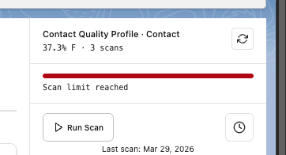
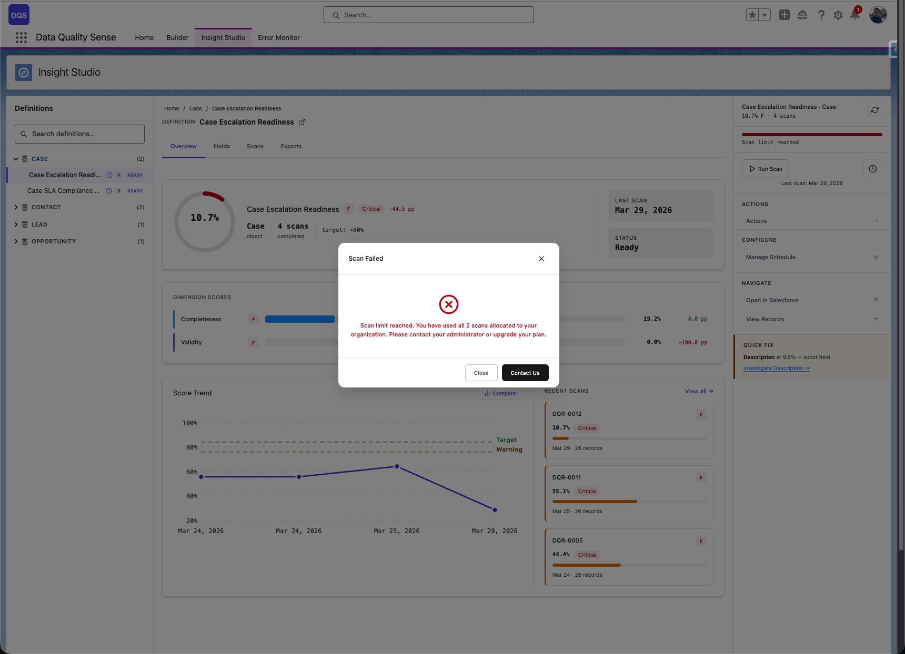
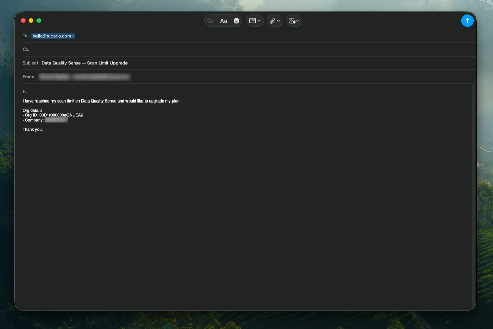

import { Aside } from '@astrojs/starlight/components';

## Límites de escaneos

Cada activación de Data Quality Sense incluye un número fijo de escaneos (20 por defecto). Cada ejecución de escaneo — manual o programada — se descuenta de esta cuota.

### Seguimiento del uso

La tarjeta de definición en Insight Studio muestra una barra de progreso con la cantidad de escaneos utilizados. Cuando el límite se acerca, la barra se vuelve roja y muestra una advertencia **Scan limit reached**.

### Qué sucede cuando se alcanza el límite

Una vez que se han utilizado todos los escaneos, intentar ejecutar uno nuevo muestra un diálogo de error informando que se ha alcanzado el límite de escaneos.

### Solicitar más escaneos

Haga clic en el botón **Upgrade** en el diálogo de error para abrir un correo electrónico prellenado solicitando escaneos adicionales. El correo está dirigido a [hello@tucario.com](mailto:hello@tucario.com) e incluye automáticamente su Org ID.

<Aside type="tip">
Los escaneos programados también cuentan para su límite. Si está quedándose sin escaneos, considere pausar las programaciones de las definiciones menos críticas.
</Aside>

## Governor Limits de Salesforce

DQS se ejecuta completamente dentro de Salesforce y está sujeto a los governor limits estándar. El motor de procesamiento está diseñado para funcionar dentro de estas restricciones.

### Límites de procesamiento por lotes

| Límite | Máximo de Salesforce | Impacto en DQS |
|--------|---------------------|----------------|
| **Tamaño de lote** | 2,000 registros por fragmento | Configurable mediante ajustes de DQS |
| **Lotes simultáneos** | 5 por organización | DQS usa 1 lote por escaneo |
| **Consultas SOQL por transacción** | 100 | Consultas dinámicas usadas eficientemente |
| **Operaciones DML por transacción** | 150 | Resultados agrupados para escrituras eficientes |
| **Tamaño de heap** | 12 MB (asíncrono) | Campos de texto grandes pueden contribuir |

### Límites de programación

| Límite | Máximo de Salesforce |
|--------|---------------------|
| **Trabajos Apex programados** | 100 por organización |
| **Triggers CRON** | 100 por organización |

<Aside type="caution">
Cada programación de escaneo de DQS consume un slot de Apex programado. Planifique en consecuencia si su organización tiene muchos otros trabajos programados.
</Aside>

## Consideraciones de rendimiento

### Tamaño del objeto

| Tamaño del objeto | Tiempo de escaneo esperado | Notas |
|-------------------|---------------------------|-------|
| < 10,000 registros | Minutos | Procesamiento rápido |
| 10,000 – 100,000 | 10–30 minutos | Procesamiento por lotes normal |
| 100,000 – 1,000,000 | 30–60 minutos | Considere programar fuera de horario pico |
| > 1,000,000 | 1+ horas | Programe durante ventanas de mantenimiento |

### Número de campos

Más campos en una definición significa más procesamiento por registro. Una definición con 50+ campos tardará más que una con 10 campos.

### Número de capacidades

Cada capacidad habilitada agrega una ejecución de estrategia de dimensión por fragmento. Habilitar las 7 capacidades toma aproximadamente 7 veces más tiempo que habilitar solo una.

## Mejores prácticas

- **Programe durante horas de baja actividad** — Minimice el impacto en los usuarios
- **Comience con poco** — Empiece con una capacidad y algunos campos clave, luego expanda
- **Monitoree los trabajos por lotes** — Use Setup → Apex Jobs para verificar el progreso del escaneo
- **Use políticas de retención** — Prevenga el crecimiento ilimitado de resultados
- **Escalone las programaciones** — No programe todas las definiciones al mismo tiempo

## Almacenamiento

Los resultados de escaneo consumen almacenamiento de datos de Salesforce. Cada escaneo crea:
- 1 Dimension Result por capacidad habilitada
- 1 Field Result por campo por capacidad
- Múltiples Metric Results por campo

Con la [retención de datos](/es/processing/data-retention/) configurada, los resultados antiguos se purgan automáticamente.
