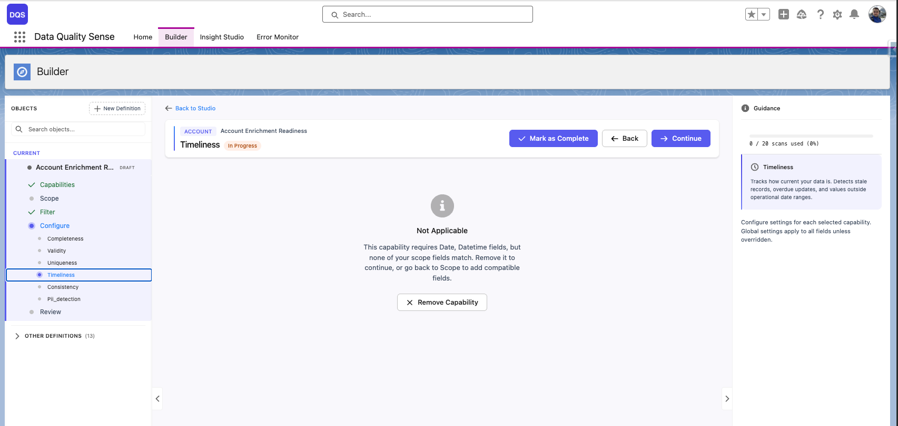

import { Aside } from '@astrojs/starlight/components';

## Configuration des capacités

La troisième étape de l'assistant Builder vous permet d'activer les dimensions de qualité et de configurer leurs paramètres. Chaque capacité évalue un aspect différent de la qualité de vos données.

## Capacités disponibles

| Capacité | Ce qu'elle mesure |
|----------|------------------|
| [Completeness](/fr/capabilities/completeness/) | Les champs sont-ils renseignés ? |
| [Validity](/fr/capabilities/validity/) | Les valeurs correspondent-elles aux formats attendus ? |
| [Uniqueness](/fr/capabilities/uniqueness/) | Y a-t-il des valeurs en double ? |
| [Timeliness](/fr/capabilities/timeliness/) | Les données sont-elles à jour ? |
| [Consistency](/fr/capabilities/consistency/) | Les champs liés sont-ils logiquement cohérents ? |
| [PII Detection](/fr/capabilities/pii-detection/) | Les données personnelles sont-elles correctement gérées ? |

## Activer une capacité

Sélectionnez une capacité dans la liste pour l'activer. Chaque capacité dispose de :

- **Configuration globale** — Paramètres par défaut appliqués à tous les champs
- **Surcharges par champ** — Paramètres personnalisés pour des champs individuels qui diffèrent des valeurs globales par défaut

## Compatibilité des champs

Certaines capacités nécessitent des types de champs spécifiques. Par exemple, Timeliness ne fonctionne qu'avec les champs Date et DateTime. Si aucun des champs de votre définition n'est compatible, la capacité affiche le message « Not Applicable » et ne peut pas être configurée tant que vous ne revenez pas au scope pour ajouter des champs compatibles.

## Configuration globale vs. par champ

La plupart des capacités vous permettent de définir des seuils globaux puis de les surcharger pour des champs spécifiques. Par exemple :

- **Completeness** : Définir un « taux de remplissage attendu » global de 90 %, mais exiger 100 % pour les champs Email
- **Validity** : Définir des règles de format globales, mais configurer des motifs regex personnalisés pour certains champs texte
- **Timeliness** : Définir une fenêtre de fraîcheur globale de 30 jours, mais utiliser 7 jours pour les champs de date critiques

La section **Defaults** en haut contrôle les paramètres globaux de la capacité (par exemple, Blank Handling et Placeholder Detection pour Completeness). Ceux-ci s'appliquent à tous les champs sauf surcharge. Le tableau **Field Overrides** en dessous liste chaque champ dans le périmètre avec son statut actuel — « Default » signifie que le champ utilise les paramètres globaux.

Pour surcharger un champ spécifique, cliquez dessus dans le tableau Field Overrides. Son statut change pour indiquer une configuration personnalisée. La flèche rouge ci-dessous pointe vers le champ Reason après application d'une surcharge par champ.

## Flux de configuration

1. **Activer la capacité** — Activez-la depuis la liste des capacités
2. **Définir les paramètres globaux** — Configurez les valeurs par défaut qui s'appliquent à tous les champs sélectionnés
3. **Ajouter des surcharges par champ** (optionnel) — Cliquez sur des champs individuels pour personnaliser leurs paramètres
4. **Vérifier** — La synthèse montre quels champs ont des surcharges

<Aside type="tip">
Vous pouvez utiliser la **configuration en masse** pour des capacités comme Completeness afin d'appliquer rapidement la même surcharge à plusieurs champs en une fois.
</Aside>

## Supprimer une capacité

Cliquez sur le bouton de suppression d'une capacité activée pour la désactiver. Cela efface toutes les configurations globales et par champ de cette capacité. L'action nécessite une confirmation.
