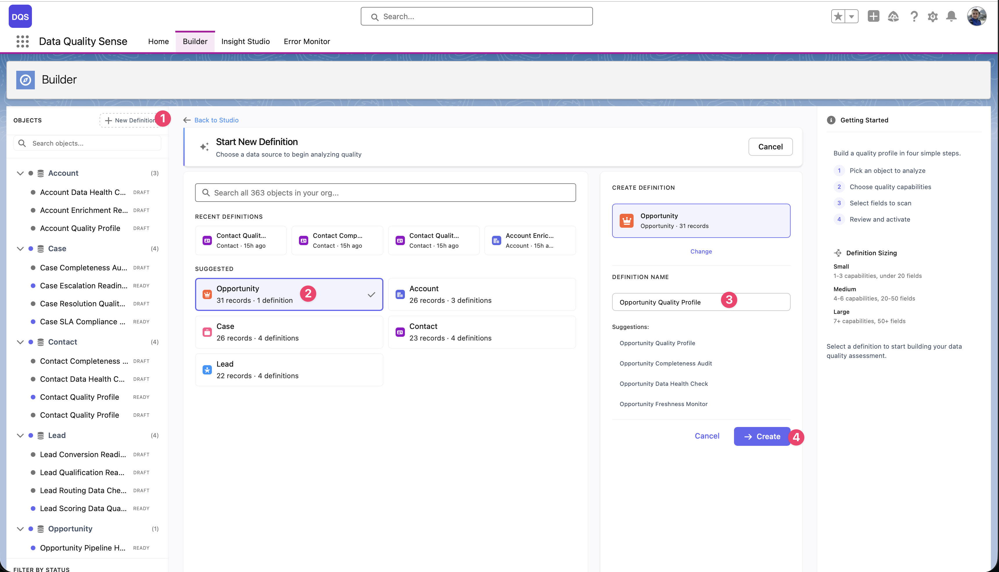
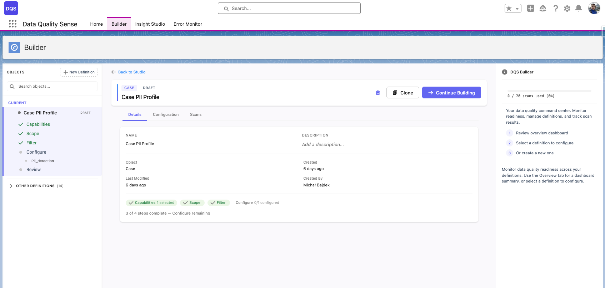
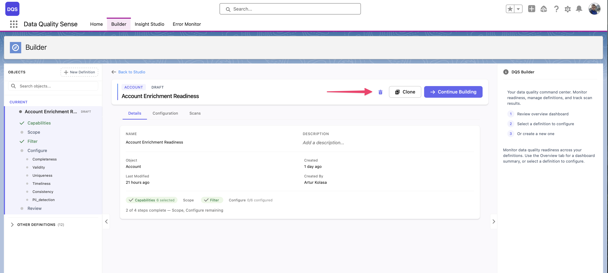

import { Aside } from '@astrojs/starlight/components';

## Qu'est-ce qu'une définition ?

Une **définition** est l'unité de configuration principale dans DQS. Elle spécifie :
- Quel objet Salesforce scanner
- Quels champs évaluer
- Quelles dimensions de qualité (capacités) mesurer
- Des surcharges optionnelles de seuils par champ

## Créer une nouvelle définition

1. **Cliquer sur « New Definition »**

   Dans l'onglet Builder, cliquez sur le bouton **New Definition** en haut à gauche. Un dialogue de création s'ouvre avec une recherche d'objets, les définitions récentes et des objets suggérés.

2. **Sélectionner l'objet cible**

   Choisissez le SObject que vous souhaitez scanner. Vous pouvez rechercher parmi tous les objets de votre organisation, choisir parmi les **Recent Definitions** (objets pour lesquels vous avez déjà créé des définitions), ou sélectionner dans la liste **Suggested** (Account, Opportunity, Contact, Case, Lead). Le dialogue affiche le nombre d'enregistrements et de définitions existantes pour chaque objet.

3. **Saisir un nom de définition**

   Une fois l'objet sélectionné, le panneau de droite affiche un champ de nom avec des **suggestions** générées automatiquement basées sur l'objet (par exemple, « Opportunity Quality Profile », « Opportunity Completeness Audit »). Choisissez une suggestion ou saisissez votre propre nom.

4. **Cliquer sur « + Create »**

   La définition est créée avec le statut **Draft** et s'ouvre dans l'assistant Builder.

<Aside type="note">
Les objets techniques (ceux dont les noms API commencent par des préfixes internes courants) sont filtrés par défaut pour garder la liste des objets gérable.
</Aside>

## Créer une définition à partir d’une mise en page

Sur **Home**, cliquez sur **Import from Layout**. Lors de la configuration initiale, l’étape de définition de **Getting Started** propose aussi **Create from Layout**.

1. Dans **Create Definition from Layout**, choisissez **Object** et **Record Type**.
2. Saisissez **Definition Name** et vérifiez les champs chargés. Retirez les champs inutiles avec **×** ; au moins un doit rester sélectionné.
3. Cliquez sur **Go To Builder** pour créer une définition **Draft** avec ces champs et l’ouvrir dans Builder.
4. Sélectionnez les capacités, vérifiez Scope et terminez la configuration restante. Les champs inaccessibles, inexistants ou non pris en charge sont exclus lors de la création du périmètre.

Pour une définition existante, utilisez [l’import dans Scope](/fr/builder/field-selection/). Le choix de Record Type dans ce dialogue ne crée pas de filtre d’enregistrements.

{/* TODO: Screenshot — layout-create-definition.png: dialogue avec Object, Record Type, Definition Name, champs sélectionnés et Go To Builder. */}

## Paramètres de la définition

Après la création, vous pouvez configurer :

| Paramètre | Description |
|-----------|-------------|
| **Name** | Nom affiché dans les listes et dans Insight Studio |
| **Object** | Le SObject cible (ne peut pas être modifié après la création) |
| **Description** | Notes optionnelles sur l'objectif du scan |
| **Status** | Étape actuelle du cycle de vie (Draft, Ready, Active, Obsolete) |

## Modifier des définitions existantes

Ouvrez n'importe quelle définition depuis le tableau d'activité récente de l'onglet **Home**, ou depuis l'arborescence de navigation du Builder. Les définitions en statut **Draft** peuvent être modifiées — cliquez sur **Continue Building** pour reprendre la configuration.

## Supprimer des définitions

Le bouton de suppression (icône corbeille) n'est disponible que lorsque **les deux** conditions sont remplies :

- La définition est en statut **Draft**
- Vous avez le Permission Set **DQS Admin** attribué

Les définitions actives ou terminées ne peuvent pas être supprimées — retirez-les au statut Obsolete à la place.

La suppression d'une définition retire tous les détails de définition associés, mais préserve les résultats de scan historiques à des fins d'audit.
