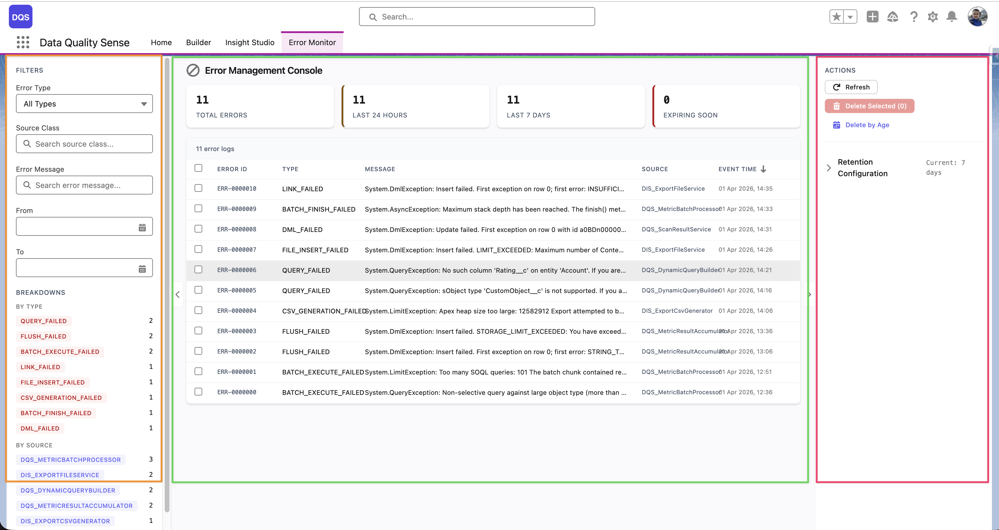
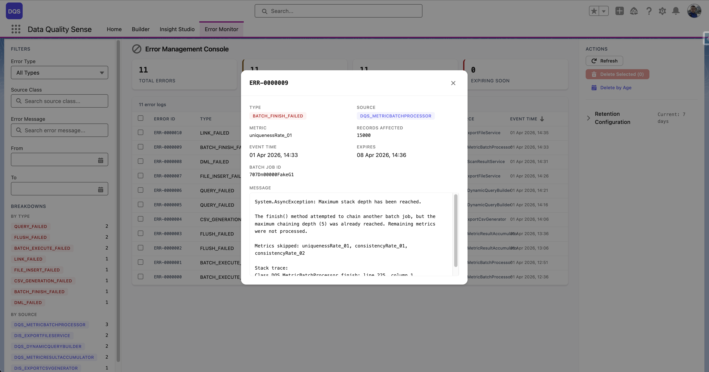
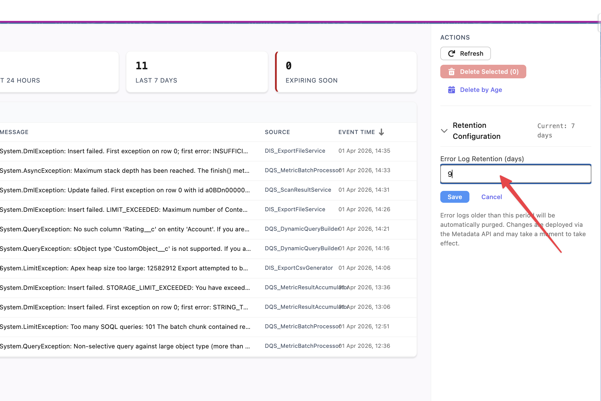

import errorMonitor from '../../../../assets/screenshots/error-monitor.png';
import errorMonitorLogDetail from '../../../../assets/screenshots/error-monitor-log-detail.png';
import errorMonitorRetentionDays from '../../../../assets/screenshots/error-monitor-retention-days.png';

## Console de gestion des erreurs (EMC)

L'onglet **Error Monitor** de l'application DQS fournit une interface dédiée pour surveiller et résoudre les erreurs qui surviennent lors du traitement des scans. Il offre une visibilité complète sur les échecs de lots, les erreurs de stratégie et les problèmes de plateforme — le tout en un seul endroit.

## Disposition

La Console de gestion des erreurs utilise une disposition en 3 zones :

- **Barre latérale de filtres** (gauche) — Filtrez les erreurs par Type d'erreur, Classe source, Message d'erreur, plage horaire (De/À) et adresse IP. Une section **Répartitions** regroupe les erreurs par type, source ou autres critères, affichant des compteurs à côté de chaque catégorie pour un triage rapide.
- **Tableau des journaux d'erreurs** (centre) — Tableau triable répertoriant toutes les erreurs avec des colonnes récapitulatives. Affiche le nombre total d'erreurs sur trois fenêtres temporelles : Dernières 24 heures, Derniers 7 jours et Expirant bientôt. Cliquez sur n'importe quelle ligne pour afficher les détails complets.
- **Panneau d'actions** (droite) — Actualisez le journal, créez un export CSV téléchargeable, supprimez les entrées sélectionnées et configurez la période de rétention.

## Tableau des journaux d'erreurs

Chaque ligne d'erreur dans le tableau affiche les colonnes suivantes :

| Colonne | Description |
|---------|-------------|
| **Error ID** | Identifiant unique de l'entrée du journal d'erreurs |
| **Type** | Catégorie d'erreur (p. ex., `DML_FAILED`, `QUERY_FAILED`, `FIELD_INSERT_FAILED`, `BATCH_EXECUTE_FAILED`) |
| **Message** | Description courte de l'erreur (tronquée — cliquez sur la ligne pour voir le message complet) |
| **Source** | La classe Apex qui a généré l'erreur (p. ex., `DQS_ExportFileService`, `DQS_DynamicQueryBuilder01`) |
| **Event Time** | Horodatage de l'occurrence de l'erreur |

Le haut du tableau affiche des compteurs agrégés — **Total Errors**, **Last 24 Hours**, **Last 7 Days** et **Expiring Soon** — offrant une vue d'ensemble de l'état de santé en un coup d'œil.

### Modale de détail de ligne

Cliquez sur n'importe quelle ligne d'erreur pour ouvrir une modale de détail avec le contexte complet :

- **Error ID** et **Type** (mis en évidence en rouge pour une identification rapide)
- **Source** — la classe Apex d'origine
- **uniqueIdentifier_01** — l'enregistrement ou l'identifiant de lot associé
- **Insert Type** — si l'opération était une insertion, une mise à jour ou un autre type DML
- **Event Time** et **First Event Time** — horodatages de l'occurrence de l'erreur
- **Message** — message d'erreur complet incluant le type d'exception Salesforce (p. ex., `System.AsyncException`, `System.DmlException`)
- **Stack Trace** — trace de pile Apex complète pour le débogage

## Sources d'erreurs

| Source | Exemples |
|--------|---------|
| **Batch Processing** | Limite de governor dépassée, timeout de requête |
| **Dimension Strategy** | Accès à un champ invalide, pointeur nul dans la logique de stratégie |
| **Platform Events** | Échec de publication d'événement |
| **Scheduling** | Problèmes d'expression CRON, erreurs de permissions |

## Intégration Platform Events

DQS utilise les Platform Events `DQS_Processing_Error__e` pour faire remonter les erreurs en temps réel. Lorsqu'une erreur survient pendant le traitement par lots :

1. L'erreur est capturée et journalisée
2. Un Platform Event est publié
3. L'EMC reçoit l'événement et l'affiche

Cela remplace les blocs `catch` silencieux par un reporting d'erreurs visible.

## Rétention des erreurs

Les journaux d'erreurs sont automatiquement purgés selon la période de rétention configurée. La rétention par défaut est de **7 jours**.

Pour modifier la période de rétention, utilisez la section **Retention Configuration** dans le panneau d'actions à droite de la console. Saisissez le nombre de jours souhaité dans le champ **Error Log Retention (days)** et cliquez sur **Save**. Les journaux d'erreurs plus anciens que la période spécifiée seront automatiquement purgés. Les modifications sont déployées via l'API Metadata et peuvent prendre un moment pour prendre effet.

## Bonnes pratiques

- Consultez l'EMC régulièrement après la mise en place de nouvelles définitions de scan
- Vérifiez les erreurs après avoir modifié les configurations de capacités
- Utilisez les motifs d'erreurs pour identifier les problèmes systématiques (p. ex., les permissions d'accès aux champs)
- Utilisez le compteur **Expiring Soon** pour examiner les erreurs avant qu'elles soient automatiquement purgées
- Exportez les journaux d'erreurs en CSV avant leur expiration si vous avez besoin de les conserver pour une analyse plus longue
- Contactez le support si les erreurs de plateforme persistent sur plusieurs scans
