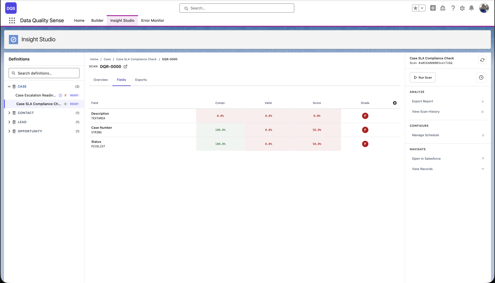

## Field Health Matrix

The field health matrix is a **grid view** showing every scanned field against every enabled dimension. Each cell displays the field's score for that dimension, color-coded by grade.

## Reading the Matrix

| Axis | Content |
|------|---------|
| **Rows** | Individual fields (sorted by overall score, worst first) |
| **Columns** | Quality dimensions (Completeness, Validity, etc.) |
| **Cells** | Score (0–100) with color indicator |

### Color Coding

- **Green cells** — Score ≥ 90 (Excellent)
- **Yellow cells** — Score 50–89 (Fair to Good)
- **Red cells** — Score < 50 (Poor to Critical)
- **Gray cells** — Not applicable (dimension doesn't apply to this field type)

## Using the Matrix

### Identify Problem Fields

Scan the matrix for rows with multiple red/yellow cells. These fields have quality issues across multiple dimensions.

### Identify Problem Dimensions

Look for columns with many red cells. These dimensions need attention across your dataset.

### Drill Down

Click any cell to navigate to the detailed field-dimension view, showing the specific metrics and records that contribute to that score.

## Sorting and Filtering

- **Sort by score** — Show the worst-performing fields first
- **Filter by dimension** — Focus on a specific quality dimension
- **Filter by field type** — Show only Text, Number, or Date fields
