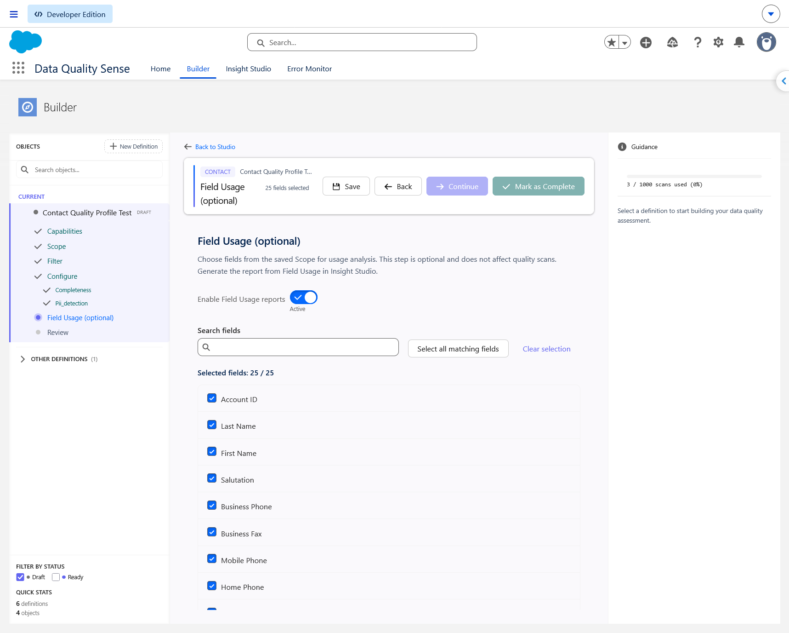
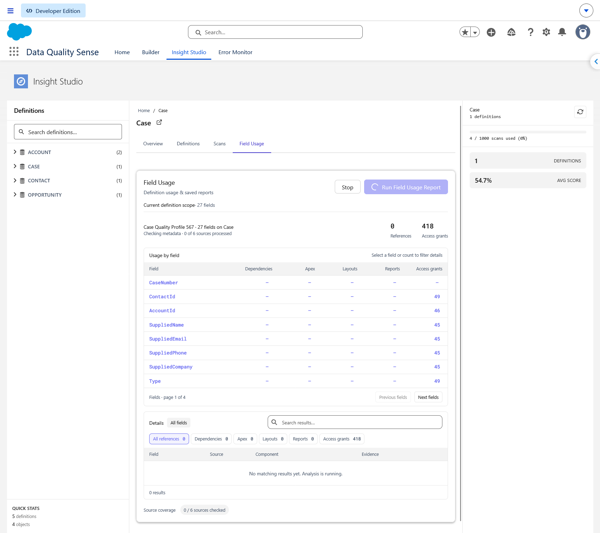
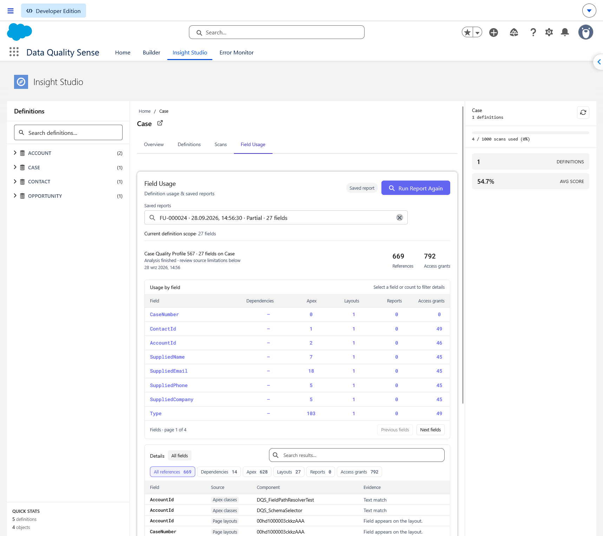
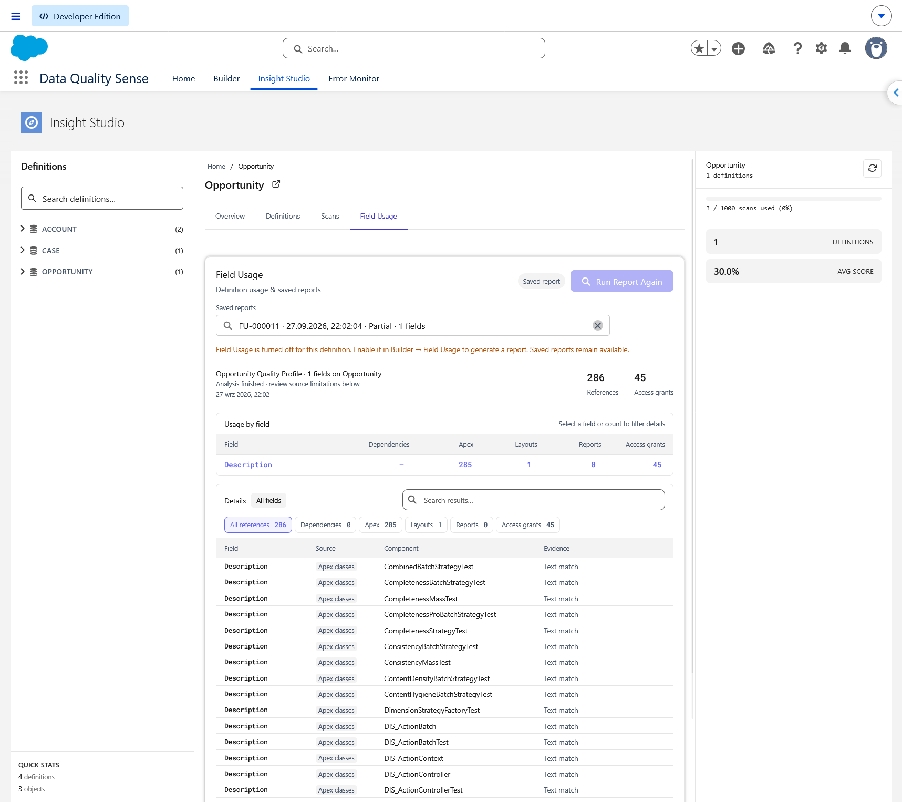

## What does Field Usage show?

Field Usage finds references to selected fields in Salesforce metadata: dependencies, Apex classes and triggers, layouts, and reports. It lists **Access grants** separately. Use it to investigate where a field is referenced before changing its configuration.

Setup, report generation, and saved reports require **DQS Administrator** access. This optional analysis runs independently of quality scans and does not change quality scores or scan schedules.

## Enable reports in Builder

1. Open the definition in [Builder](/builder/overview/) and save the fields in **Scope**.
2. After **Configure**, open **Field Usage (optional)**, before **Review**.
3. Turn on **Enable Field Usage reports**. New and existing definitions start with reporting disabled. Turning the switch on selects all accessible fields in the saved Scope; deselect any you do not want to analyze.
4. Search by field label or API name. **Select all** (labelled **Select all matching fields** in the screenshot) selects the entire available Scope, including fields outside the current search or page. **Clear selection** removes the selection. The list shows 25 fields per page.
5. Keep at least one field selected and click **Save** in the Builder header before continuing.

Reopening enabled settings preserves the saved selection. Fields added to Scope later are not selected automatically; removed or inaccessible fields are excluded from new reports. If Scope has no accessible fields, save fields in Scope first or leave Field Usage disabled.

You can leave Field Usage disabled and still complete the definition. In Configure, **Confirm Configuration** confirms capability settings; **Continue** advances to Field Usage. **Mark as Complete** is available from Field Usage and Review once required configuration is complete and Field Usage changes are saved.

## Run a report

1. In Insight Studio, open **Field Usage** on an object or definition. In the object view, choose a definition first.
2. Expand **Current definition scope** to check the fields selected for the next report.
3. Click **Run Field Usage Report** (or **Run Report Again** when a report is already open). The app checks the latest saved settings and analyzes that selection. Opening the tab or running a quality scan does not start a new usage report.

Results appear as sources are checked. **Stop** ends analysis and saves the results collected so far with a Stopped status. Leaving the view stops analysis without automatically saving an in-progress report.

## Read the results

- **Usage by field** shows counts for Dependencies, Apex, Layouts, Reports, and Access grants, with eight fields per page. Click a field or count to filter the details.
- **Details** shows Field, Source, Component, and Evidence, with search, source filters, and 15 rows per page. **All references** excludes access grants; select **Access grants** to inspect permissions.
- **0** means the source was checked without finding references. **—** means coverage is incomplete and no matches have been collected. Review source coverage even when a count is positive.
- Apex evidence is labelled **Text match**. An access grant indicates permission to a field, not proof that the field is used. Partial or unavailable sources mean the report cannot establish that a field has no references.

## Saved reports

Completed and explicitly stopped reports save automatically. The latest saved report opens when you return; **Saved reports** offers the latest 50 reports for the selected definition. Opening history does not rerun analysis. Each saved report retains its original fields and timestamp, separately from the current definition scope.

Disabling Field Usage in Builder prevents new reports while keeping saved reports readable. If saving fails, results stay visible and **Retry Save** retries without another analysis. Reports exceeding the save limit of 500,000 JSON characters remain visible but unsaved; select fewer fields for a new report.

