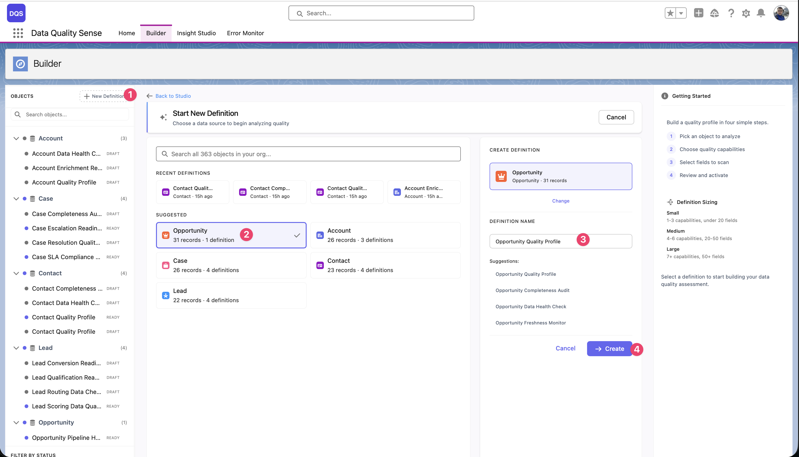

import { Aside } from '@astrojs/starlight/components';

## 定義とは

**定義**はDQSの中核となる構成単位です。以下を指定します：
- スキャンするSalesforceオブジェクト
- 評価する項目
- 測定する品質ディメンション（ケイパビリティ）
- オプションの項目ごとのしきい値オーバーライド

## 新しい定義の作成

1. **「New Definition」をクリック**

   Builderタブの左上隅にある**New Definition**ボタンをクリックします。オブジェクト検索、最近の定義、推奨オブジェクトを含む作成ダイアログが開きます。

2. **対象オブジェクトを選択**

   スキャンするSObjectを選択します。組織内のすべてのオブジェクトを検索するか、**Recent Definitions**（すでに定義を作成したオブジェクト）から選択するか、**Suggested**リスト（Account、Opportunity、Contact、Case、Lead）から選択できます。ダイアログには各オブジェクトのレコード数と既存の定義数が表示されます。

3. **定義名を入力**

   オブジェクトを選択すると、右側のパネルにオブジェクトに基づいた自動生成の**候補**（例：「Opportunity Quality Profile」、「Opportunity Completeness Audit」）が表示された名前フィールドが表示されます。候補を選択するか、独自の名前を入力してください。

4. **「+ Create」をクリック**

   定義が**Draft**ステータスで作成され、Builderウィザードで開きます。

<Aside type="note">
技術的なオブジェクト（一般的な内部プレフィックスで始まるAPI名を持つもの）は、オブジェクトリストを管理しやすくするためにデフォルトでフィルタリングされます。
</Aside>

## 定義の設定

作成後、以下を構成できます：

| 設定 | 説明 |
|---------|-------------|
| **名前** | リストやInsight Studioに表示される表示名 |
| **オブジェクト** | 対象のSObject（作成後は変更不可） |
| **説明** | スキャンの目的に関するオプションのメモ |
| **ステータス** | 現在のライフサイクルステージ（Draft、Ready、Active、Obsolete） |

## 既存の定義の編集

**Home**タブの最近のアクティビティテーブル、またはBuilderのサイドバーナビゲーションツリーから任意の定義を開きます。Active定義は編集可能で、変更は次回のスキャンで反映されます。

## 定義の削除

削除ボタン（ゴミ箱アイコン）は、以下の**両方の**条件が満たされた場合のみ利用可能です：

- 定義が**Draft**ステータスである
- **DQS Admin** Permission Setが割り当てられている

ActiveまたはCompleted定義は削除できません。代わりにObsoleteステータスに退避させてください。

定義を削除すると、関連するすべての定義詳細が削除されますが、監査目的でスキャン結果の履歴は保持されます。
