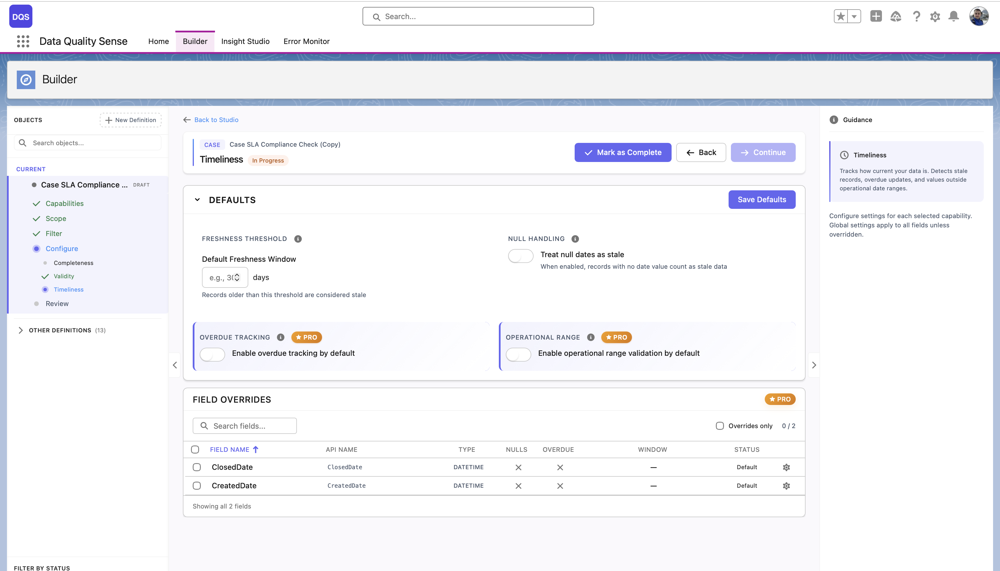
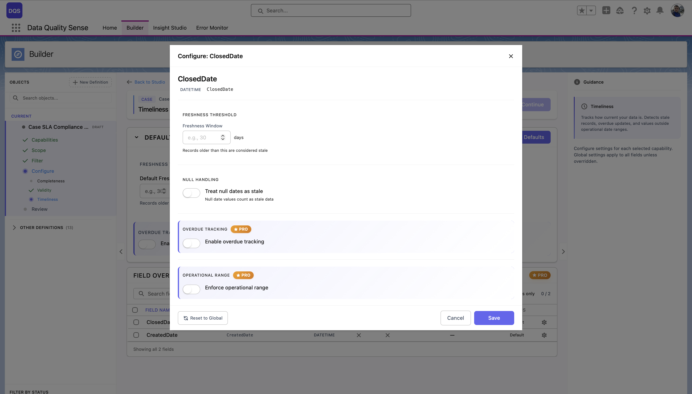

## Timelinessとは

Timelinessは、日付やdatetime項目に**最新の値**が含まれているかを測定します。「このデータはまだ新鮮か？」という問いに答えます。

## 仕組み

各日付項目に対して、Timelinessストラテジーは以下を実行します：

1. 日付/datetime値を読み取る
2. 経過時間（値と現在の日付の差）を計算
3. 経過時間を構成された鮮度ウィンドウと比較
4. ウィンドウより古い値を「陳腐化」としてマーク

## 構成

### グローバル設定

**Defaults**セクションでは、グローバルなTimelinessオプションを制御します：

| 設定 | 説明 |
|---------|-------------|
| **鮮度しきい値** | デフォルトの鮮度ウィンドウ（日数） — このしきい値より古いレコードは陳腐化とみなされます。 |
| **Null処理** | **null日付を陳腐化として扱う** — 有効にすると、日付値のないレコードは陳腐化データとしてカウントされます。 |
| **期限超過追跡** | デフォルトで期限超過追跡を有効にします。期待される日付を過ぎたレコードをフラグします。*(PRO)* |
| **運用範囲** | デフォルトで運用範囲バリデーションを有効にします。日付が許容可能な時間範囲内にあるかを確認します。*(PRO)* |

**Field Overrides**テーブルには、各日付項目の現在のしきい値、期限超過、ウィンドウの設定がリストされます。

### 項目ごとのオーバーライド

Field Overridesテーブルで項目をクリックすると、構成モーダルが開きます。グローバルデフォルトとは独立して、カスタムの**鮮度しきい値**（日数）を設定し、**Null処理**、**期限超過追跡**、**運用範囲**を切り替えることができます。**Revert to Global**リンクを使用して項目をグローバル設定にリセットできます。

日付項目ごとに異なる鮮度要件がある場合があります：

| 項目の例 | 推奨ウィンドウ |
|--------------|-------------------|
| `LastActivityDate` | 7日 |
| `LastModifiedDate` | 30日 |
| `Contract_End_Date__c` | 90日 |
| `Annual_Review_Date__c` | 365日 |

## スコアリング

| 結果 | スコア |
|--------|-------|
| すべての日付がウィンドウ内 | 100 |
| 一部の日付が陳腐化 | 新鮮な割合に比例 |
| すべての日付が陳腐化 | 0 |
| データなし | 0 |

## ユースケース

- 営業担当者がOpportunityの日付を最新に保っているかを監視
- 最近更新されていない陳腐化したContactを追跡
- コンプライアンス関連の日付が維持されていることを確認
- クリーンアップやアーカイブが必要な「デッド」レコードを特定
