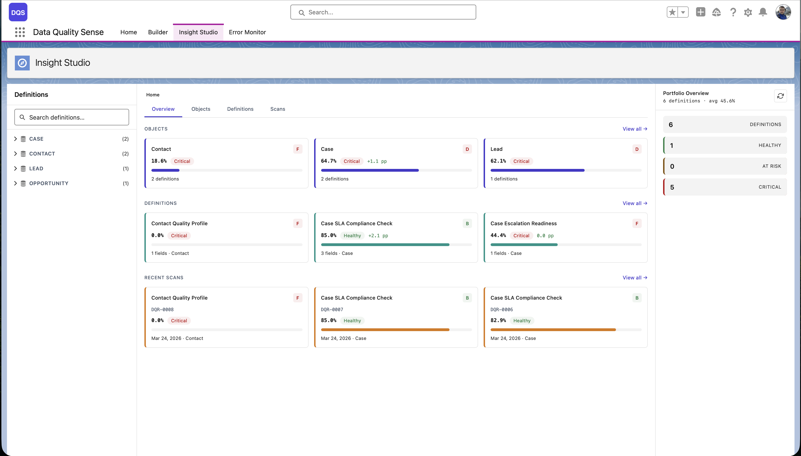

import { Card, CardGrid } from '@astrojs/starlight/components';

## Insight Studioとは

Insight Studio（DIS）は、Data Quality Senseの**可視化・分析レイヤー**です。スキャン結果を取り込み、インタラクティブなダッシュボード、チャート、レコメンデーションとして表示します。

## ワークスペースレイアウト

Insight Studioは**3ゾーンレイアウト**を使用します：

- **サイドバー** — オブジェクト/定義のナビゲーション、フィルター、内訳オプション
- **ステージ** — スコア、チャート、データテーブルを含むメインコンテンツエリア
- **メンターパネル** — AIによるレコメンデーションとコンテキストアクション

<CardGrid>
	<Card title="スコア概要" icon="open-book">
		各ディメンションの品質スコアを一覧表示し、全体評価とグレード指標を提供します。
	</Card>
	<Card title="トレンド分析" icon="open-book">
		スパークラインとトレンドチャートで、スキャン間のデータ品質の変化を表示します。
	</Card>
	<Card title="項目ヘルス" icon="open-book">
		各項目のディメンションごとの品質スコアをマトリクスビューで表示します。最も弱い項目を素早く特定できます。
	</Card>
	<Card title="AIメンター" icon="open-book">
		スキャン結果に基づくコンテキストレコメンデーション。データ品質を改善するためのアクションを提案します。
	</Card>
</CardGrid>

## 主な機能

| 機能 | 説明 |
|---------|-------------|
| **マルチレベルナビゲーション** | Home → Object → Definition → Scan → Field → Dimensionにドリルダウン |
| **スコア比較** | 2つのスキャン間の結果を比較し、改善や後退を確認 |
| **アクションメニュー** | 影響を受けたレコードに対してTask作成、Chatter投稿、CSVエクスポートを実行 |
| **スキャントリガー** | ダッシュボードから手動でスキャンをトリガー |
| **スケジュール管理** | スキャンスケジュールの作成と管理 |

## 詳細

- [ナビゲーション](/ja/insight-studio/navigation/)
- [スコアとトレンド](/ja/insight-studio/scores-trends/)
- [項目ヘルス](/ja/insight-studio/field-health/)
- [アクション](/ja/insight-studio/actions/)
- [エクスポート](/ja/insight-studio/exports/)
