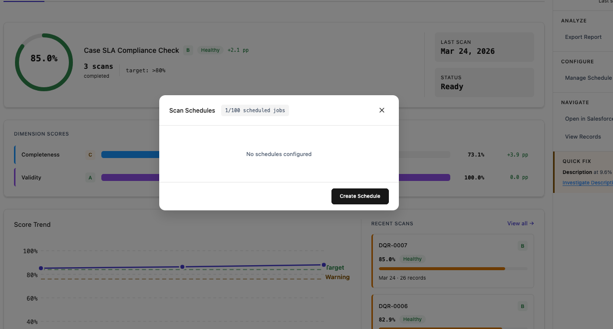
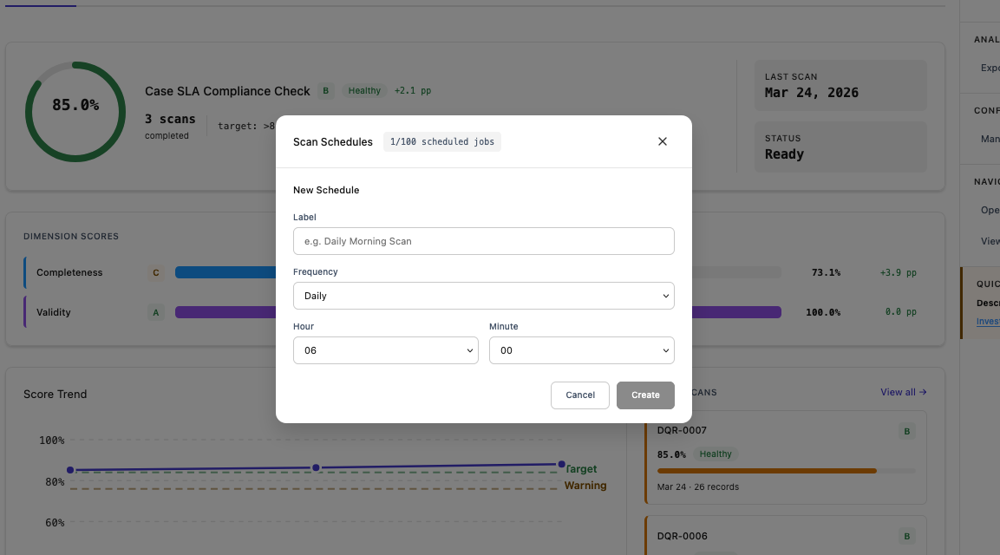
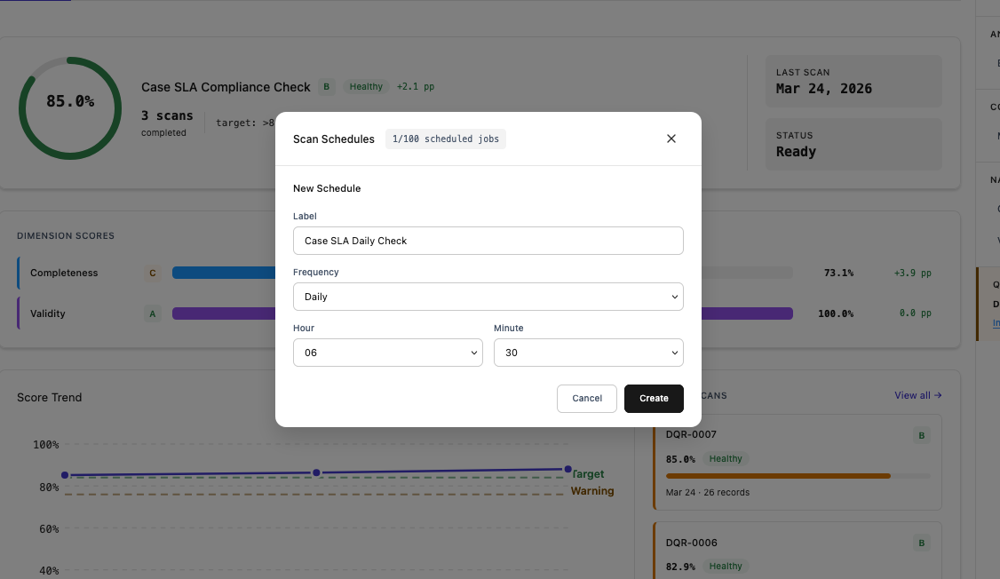
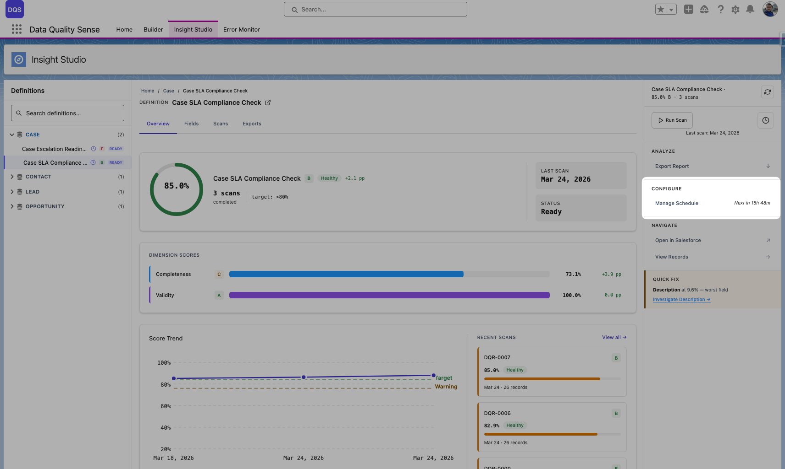
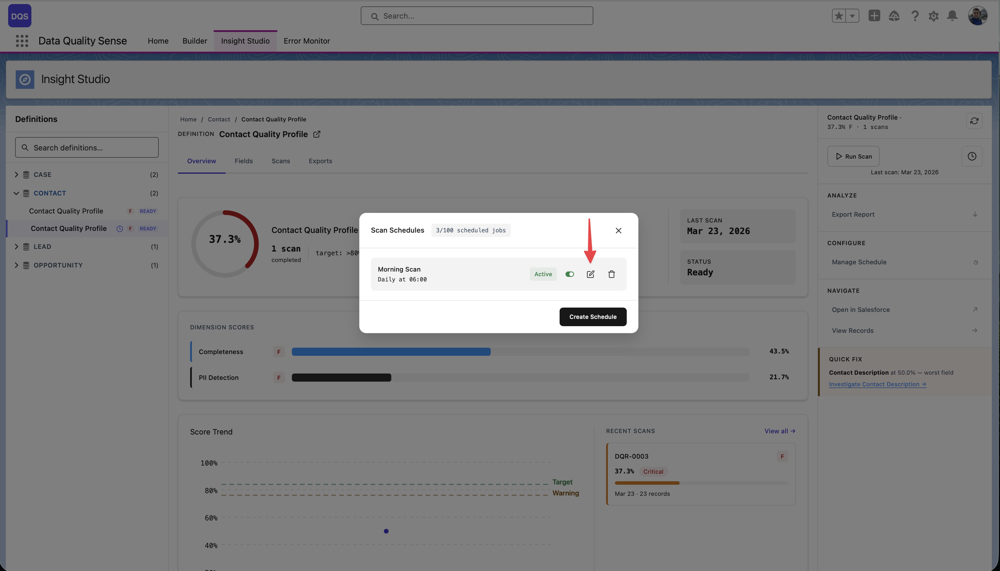
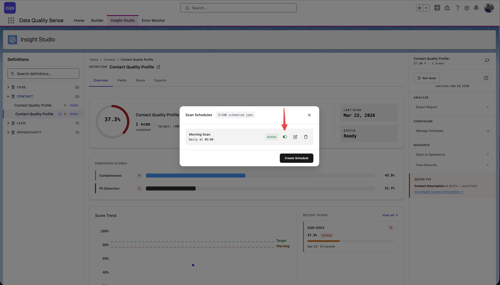

import { Aside } from '@astrojs/starlight/components';

## スキャンスケジューリング

DQSはCRONベースのスケジューリングによる**自動定期スキャン**をサポートしています。構成後、手動操作なしでスキャンが自動的に実行されます。

## スケジュールの作成

1. **Insight Studio**で定義に移動
2. サイドバーから**Scan Schedules**モーダルを開く
3. **Create Schedule**をクリック

4. スケジュールを構成 — 頻度、時間、オプションで名前を設定：

5. レビューしてスケジュールを**保存**：

<video src="/videos/manage-schedule.mp4" controls muted loop style="width:100%;border-radius:0.5rem;border:1px solid var(--sl-color-hairline-light)">お使いのブラウザはvideoタグをサポートしていません。</video>

## スケジュール設定

| 設定 | 説明 | 例 |
|---------|-------------|---------|
| **Name** | スケジュールの表示名 | Case SLA Daily Check |
| **Frequency** | スキャンの実行頻度 | Daily、Weekly、Monthly |
| **Time** | 実行する時刻 | 06:30 |
| **Day of Week** | 週次スケジュールの場合 | Monday |
| **Day of Month** | 月次スケジュールの場合 | 1st |

## CRON式

内部的には、スケジュールはSalesforce CRON式を使用します。DQSはCRON式を自動生成する**ユーザーフレンドリーなUI**を提供していますが、上級ユーザーはカスタム式を設定することもできます。

### 一般的なスケジュール

| スケジュール | CRON式 |
|----------|----------------|
| 毎日午前2時 | `0 0 2 * * ?` |
| 毎週月曜日午前6時 | `0 0 6 ? * MON` |
| 毎月1日午前0時 | `0 0 0 1 * ?` |
| 平日毎日午前5時 | `0 0 5 ? * MON-FRI` |

## スケジュール管理

### スケジュールの表示

Scan Schedulesモーダルには、すべての構成済みスケジュールのステータス、頻度、次回の実行時間が表示されます。カウンターにはSalesforceの上限に対するスケジュール済みジョブの使用数が表示されます（例：2/100）。

### スケジュールの編集

編集アイコンをクリックしてスケジュール設定を変更します。既存のスケジュールが新しい構成に置き換えられます。

### 有効化 / 無効化

**Active**トグルを使用して、スケジュールを削除せずに一時停止できます。

### スケジュールの削除

削除アイコンをクリックしてスケジュールを削除します。手動スキャンは引き続き利用可能です。

<Aside type="note">
スケジュール時間はSalesforce組織のタイムゾーンを使用します。カウントダウン表示は正しいローカル時間を表示します。
</Aside>

## 監査証跡

すべてのスキャンはトリガー元を記録します：
- **手動スキャン** — 「Run Scan」をクリックしたユーザーを記録
- **スケジュールスキャン** — トリガーソースとして「Scheduled」を記録
- **タイムスタンプ** — スキャンの開始時刻と完了時刻

## 考慮事項

- **Active**定義のみスケジュール可能
- スキャンの実行にはSalesforceガバナーリミット（バッチApex）を消費
- ユーザーへの影響を最小限にするため、オフピーク時間帯にスケジュール
- 複数の定義を異なる時間にスケジュール可能
