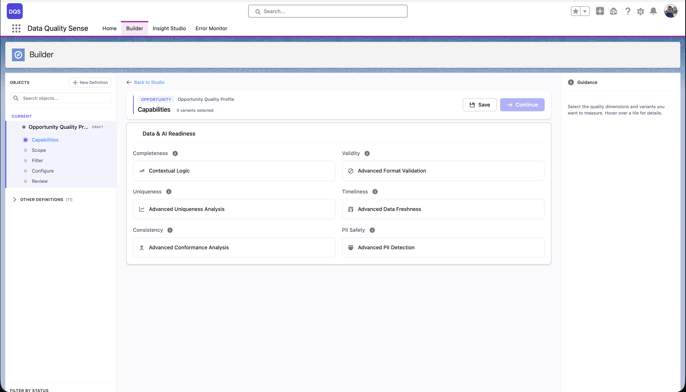
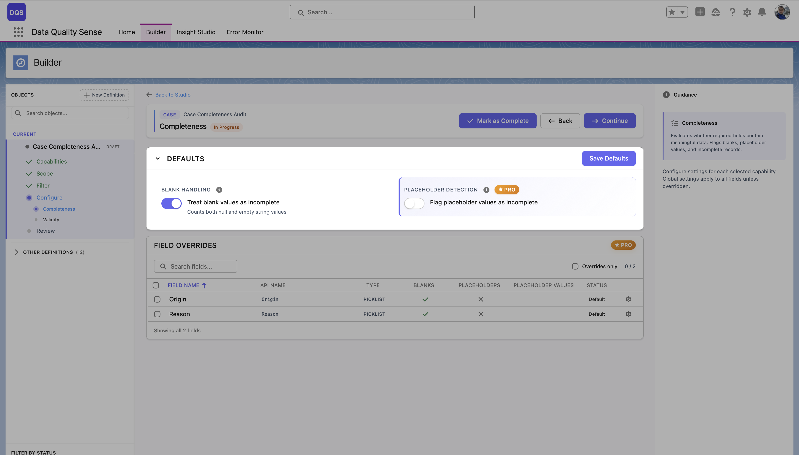
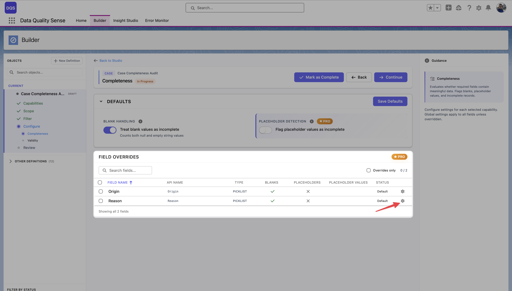
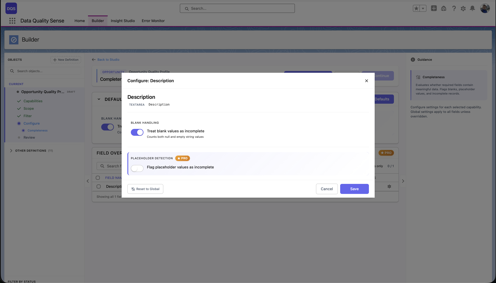

import { Aside } from '@astrojs/starlight/components';

## Konfiguracja zdolności

Trzeci etap kreatora Builder pozwala włączyć wymiary jakości i skonfigurować ich ustawienia. Każda zdolność ocenia inny aspekt jakości danych.

## Dostępne zdolności

| Zdolność | Co mierzy |
|----------|-----------|
| [Completeness](/pl/capabilities/completeness/) | Czy pola są wypełnione? |
| [Validity](/pl/capabilities/validity/) | Czy wartości odpowiadają oczekiwanym formatom? |
| [Uniqueness](/pl/capabilities/uniqueness/) | Czy występują zduplikowane wartości? |
| [Timeliness](/pl/capabilities/timeliness/) | Czy dane są aktualne? |
| [Consistency](/pl/capabilities/consistency/) | Czy powiązane pola są logicznie spójne? |
| [PII Detection](/pl/capabilities/pii-detection/) | Czy dane osobowe są prawidłowo obsługiwane? |

## Włączanie zdolności

Wybierz zdolność z listy, aby ją włączyć. Każda zdolność posiada:

- **Konfiguracja globalna** — Domyślne ustawienia stosowane do wszystkich pól
- **Nadpisania per pole** — Niestandardowe ustawienia dla poszczególnych pól, różniące się od domyślnych globalnych

## Konfiguracja globalna vs. per pole

Większość zdolności pozwala ustawić globalne progi, a następnie nadpisać je dla konkretnych pól. Na przykład:

- **Completeness**: Ustaw globalny „oczekiwany wskaźnik wypełnienia" na 90%, ale wymagaj 100% dla pól Email
- **Validity**: Zdefiniuj globalne reguły formatowania, ale ustaw niestandardowe wzorce regex dla określonych pól tekstowych
- **Timeliness**: Ustaw globalne okno świeżości na 30 dni, ale użyj 7 dni dla krytycznych pól daty

Sekcja **Defaults** na górze kontroluje ustawienia globalne zdolności (np. Blank Handling i Placeholder Detection dla Completeness). Mają one zastosowanie do wszystkich pól, chyba że zostaną nadpisane. Tabela **Field Overrides** poniżej wymienia każde pole w zakresie z bieżącym statusem — „Default" oznacza, że pole korzysta z ustawień globalnych.

Aby nadpisać ustawienia konkretnego pola, kliknij je w tabeli Field Overrides. Jego status zmieni się, wskazując konfigurację niestandardową. Czerwona strzałka poniżej wskazuje pole Reason po zastosowaniu nadpisania per pole.

## Przepływ konfiguracji

1. **Włącz zdolność** — Aktywuj ją z listy zdolności
2. **Ustaw ustawienia globalne** — Skonfiguruj domyślne dla wszystkich wybranych pól
3. **Dodaj nadpisania pól** (opcjonalnie) — Kliknij poszczególne pola, aby dostosować ich ustawienia
4. **Przejrzyj** — Podsumowanie pokazuje, które pola mają nadpisania

<Aside type="tip">
Możesz użyć **konfiguracji zbiorczej** dla zdolności takich jak Completeness, aby szybko ustawić to samo nadpisanie dla wielu pól naraz.
</Aside>

## Usuwanie zdolności

Kliknij przycisk usuwania na dowolnej włączonej zdolności, aby ją wyłączyć. Spowoduje to wyczyszczenie wszystkich globalnych i per-polowych konfiguracji dla tej zdolności. Akcja wymaga potwierdzenia.
