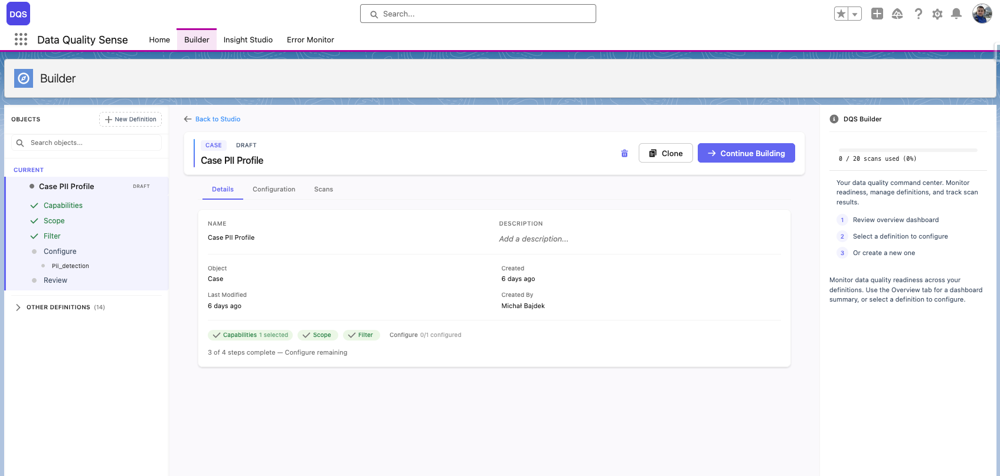

import { Aside } from '@astrojs/starlight/components';

## Czym jest definicja?

**Definicja** to podstawowa jednostka konfiguracyjna w DQS. Określa ona:
- Który obiekt Salesforce ma być skanowany
- Które pola mają być oceniane
- Które wymiary jakości (zdolności) mają być mierzone
- Opcjonalne nadpisania progów dla poszczególnych pól

## Tworzenie nowej definicji

1. **Kliknij „New Definition"**

   W zakładce Builder kliknij przycisk **New Definition** w lewym górnym rogu. Otworzy się okno dialogowe tworzenia z wyszukiwaniem obiektów, ostatnimi definicjami i sugerowanymi obiektami.

2. **Wybierz obiekt docelowy**

   Wybierz SObject, który chcesz skanować. Możesz przeszukać wszystkie obiekty w organizacji, wybrać z **Recent Definitions** (obiekty, dla których już utworzyłeś definicje) lub z listy **Suggested** (Account, Opportunity, Contact, Case, Lead). Okno dialogowe pokazuje liczbę rekordów i istniejących definicji dla każdego obiektu.

3. **Wprowadź nazwę definicji**

   Po wybraniu obiektu prawy panel wyświetla pole nazwy z automatycznie generowanymi **sugestiami** na podstawie obiektu (np. „Opportunity Quality Profile", „Opportunity Completeness Audit"). Wybierz sugestię lub wpisz własną nazwę.

4. **Kliknij „+ Create"**

   Definicja zostanie utworzona ze statusem **Draft** i otworzy się w kreatorze Builder.

<Aside type="note">
Obiekty techniczne (o nazwach API zaczynających się od typowych prefiksów wewnętrznych) są domyślnie filtrowane, aby lista obiektów była przejrzysta.
</Aside>

## Ustawienia definicji

Po utworzeniu można skonfigurować:

| Ustawienie | Opis |
|------------|------|
| **Name** | Nazwa wyświetlana na listach i w Insight Studio |
| **Object** | Docelowy SObject (nie można zmienić po utworzeniu) |
| **Description** | Opcjonalne notatki o celu skanu |
| **Status** | Bieżący etap cyklu życia (Draft, Ready, Active, Obsolete) |

## Edycja istniejących definicji

Otwórz dowolną definicję z tabeli ostatniej aktywności na karcie **Home** lub z drzewa nawigacji w pasku bocznym Builder. Definicje w statusie **Draft** można edytować — kliknij **Continue Building**, aby kontynuować konfigurację.

## Usuwanie definicji

Przycisk usuwania (ikona kosza) jest dostępny tylko wtedy, gdy **oba** warunki są spełnione:

- Definicja ma status **Draft**
- Użytkownik ma przypisany zestaw uprawnień **DQS Admin**

Aktywnych lub ukończonych definicji nie można usunąć — zamiast tego należy przenieść je do statusu Obsolete.

Usunięcie definicji powoduje usunięcie wszystkich powiązanych szczegółów definicji, ale zachowuje historyczne wyniki skanów na potrzeby audytu.
