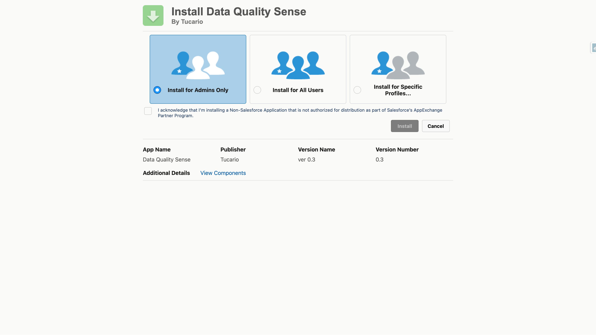
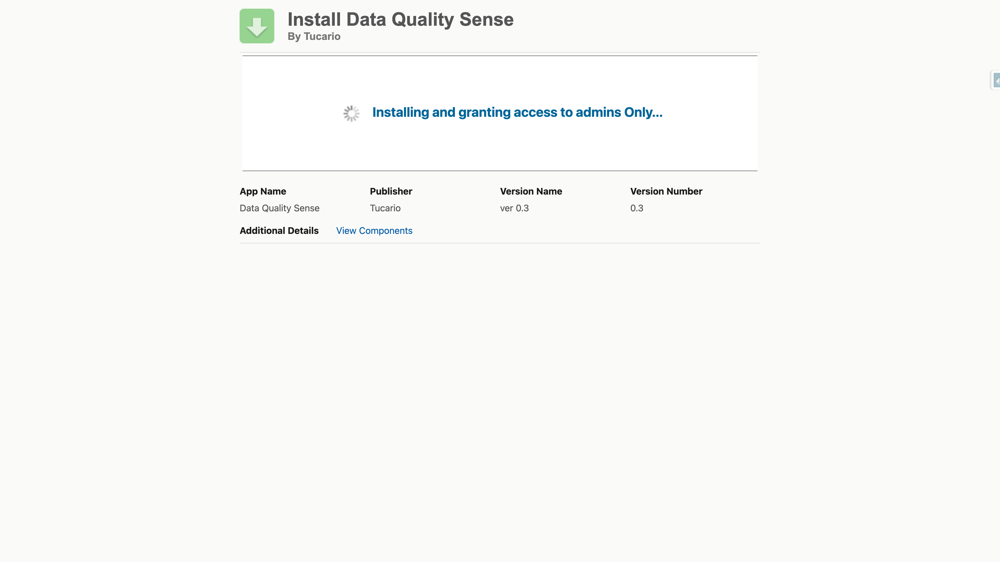
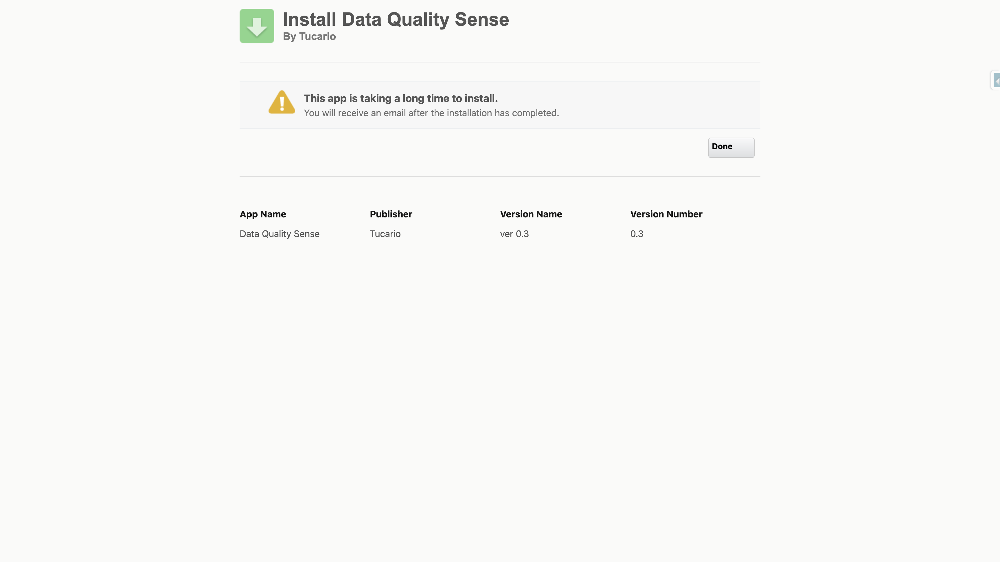
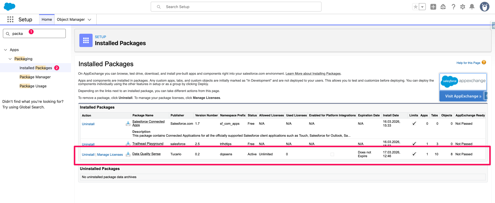
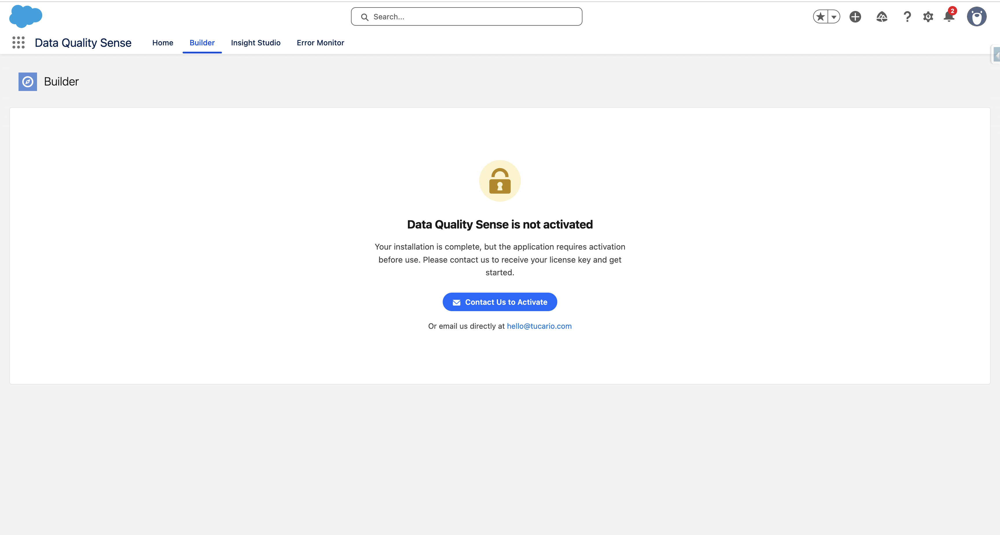
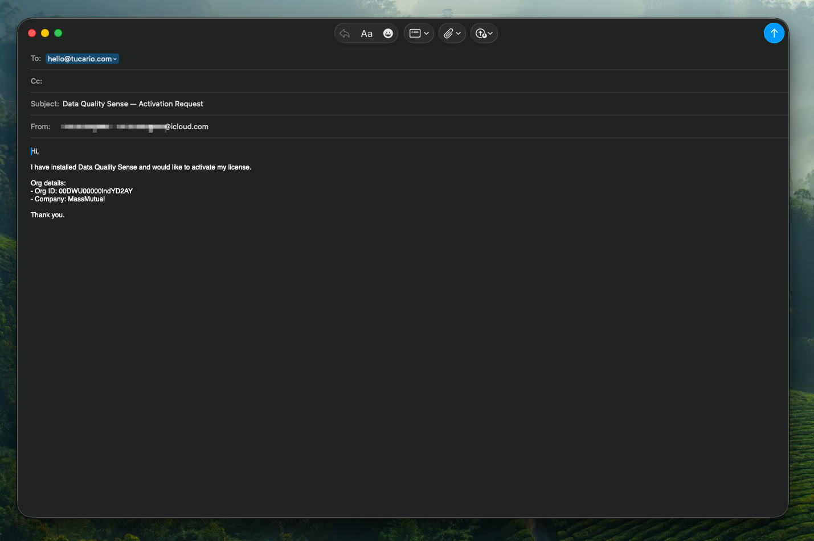
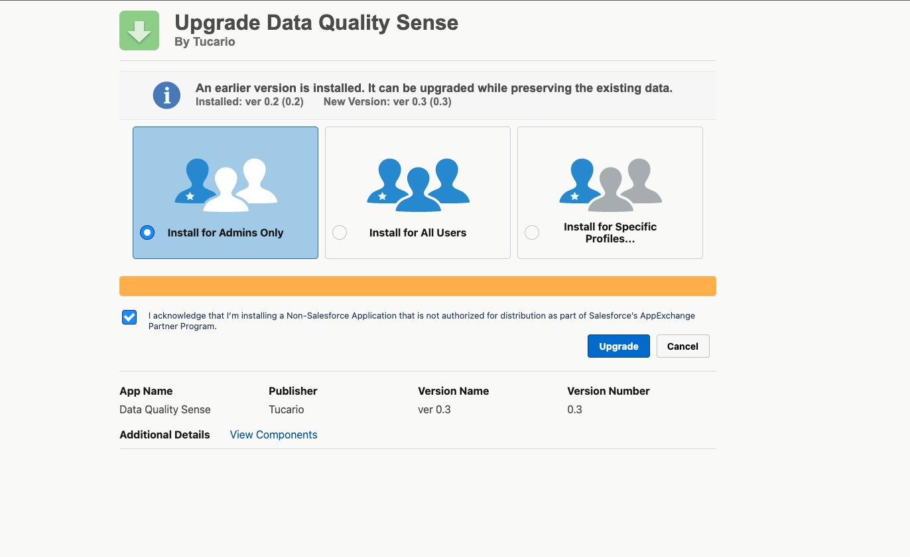

import { Aside } from '@astrojs/starlight/components';

<Aside type="tip" title="Wypróbuj wersję beta">
Data Quality Sense nie jest jeszcze dostępny na AppExchange. Możesz zainstalować aktualną wersję beta bezpośrednio:

[Zainstaluj pakiet beta](https://login.salesforce.com/packaging/installPackage.apexp?p0=04tWV0000005BinYAE)
</Aside>

## Wymagania wstępne

- Organizacja Salesforce (edycja Enterprise, Unlimited lub Developer)
- Profil System Administrator lub równoważne uprawnienia
- Włączony Lightning Experience

## Instalacja pakietu

1. **Uzyskaj link instalacyjny**

   Skontaktuj się z nami na stronie [dataqualitysense.com](https://dataqualitysense.com), aby otrzymać adres URL instalacji pakietu zarządzanego dla Twojej organizacji.

2. **Wybierz zakres instalacji**

   Określ, kto powinien mieć dostęp:
   - **Install for Admins Only** — zalecane do początkowej konfiguracji
   - **Install for All Users** — jeśli wszyscy użytkownicy potrzebują natychmiastowego dostępu
   - **Install for Specific Profiles** — dla szczegółowej kontroli dostępu

   

3. **Zatwierdź dostęp dla aplikacji zewnętrznych**

   Pakiet nie wymaga żadnych zewnętrznych wywołań. Całe przetwarzanie odbywa się w ramach Twojej organizacji Salesforce.

4. **Poczekaj na zakończenie instalacji**

   Instalator wyświetli postęp. W przypadku większych organizacji instalacja może potrwać kilka minut — po jej zakończeniu otrzymasz wiadomość e-mail.

   

   

5. **Zweryfikuj instalację**

   Przejdź do **Setup → Installed Packages** i upewnij się, że `Data Quality Sense` jest widoczny z przestrzenią nazw `dqssens`.

   

<Aside type="tip">
Po instalacji przejdź do sekcji [Uprawnienia](/pl/getting-started/permissions/), aby skonfigurować dostęp użytkowników.
</Aside>

## Aktywacja aplikacji

Po instalacji Data Quality Sense **nie jest jeszcze aktywny**. Gdy otworzysz aplikację po raz pierwszy, zobaczysz ekran blokady informujący o konieczności aktywacji.

Kliknij **Contact Us to Activate**, aby otworzyć wstępnie wypełnioną wiadomość e-mail z identyfikatorem Twojej organizacji i szczegółami. Możesz również napisać do nas bezpośrednio na adres [hello@tucario.com](mailto:hello@tucario.com).

Aktywujemy aplikację zdalnie — po Twojej stronie nie są wymagane żadne dodatkowe kroki instalacyjne. Po aktywacji ekran blokady znika, a aplikacja jest gotowa do użycia z **20 skanami** w zestawie.

<Aside type="note">
Aktywacja jest powiązana z Twoją organizacją Salesforce. Jeśli zainstalujesz pakiet w nowej organizacji (np. w sandboxie), konieczna będzie osobna aktywacja.
</Aside>

## Po instalacji

Pakiet instaluje wszystkie wymagane komponenty — obiekty niestandardowe, komponenty Lightning oraz zestawy uprawnień. Dodatkowa konfiguracja tych komponentów nie jest wymagana.

## Aktualizacja pakietu

Aby zaktualizować do nowszej wersji, użyj tego samego linku instalacyjnego — Salesforce wykryje istniejący pakiet i zaproponuje ścieżkę aktualizacji. Instalator pokazuje aktualnie zainstalowaną wersję oraz nową dostępną wersję. Wybierz ten sam zakres instalacji co poprzednio (lub zmień go w razie potrzeby) i kliknij **Upgrade**.

Definicje skanów, wyniki i konfiguracja są zachowywane podczas aktualizacji — żadne dane nie zostaną utracone.
