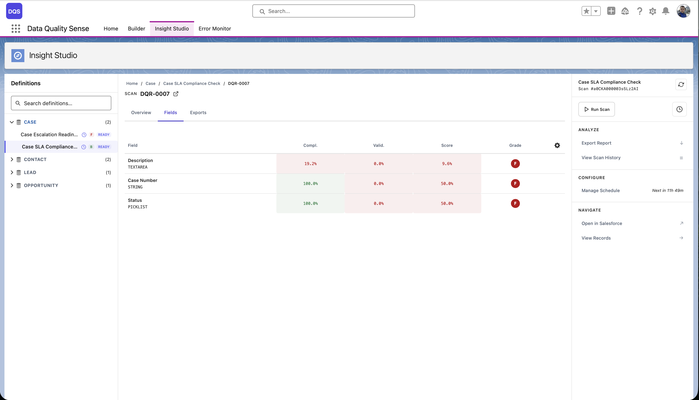

## Macierz kondycji pól

Macierz kondycji pól to **widok siatki** pokazujący każde skanowane pole w odniesieniu do każdego włączonego wymiaru. Każda komórka wyświetla wynik pola dla danego wymiaru, zakodowany kolorami według klasy.

## Odczytywanie macierzy

| Oś | Zawartość |
|----|-----------|
| **Wiersze** | Poszczególne pola (posortowane według ogólnego wyniku, najgorsze na górze) |
| **Kolumny** | Wymiary jakości (Completeness, Validity itp.) |
| **Komórki** | Wynik (0–100) ze wskaźnikiem koloru |

### Kodowanie kolorami

- **Zielone komórki** — Wynik ≥ 90 (Doskonały)
- **Żółte komórki** — Wynik 50–89 (Dostateczny do Dobry)
- **Czerwone komórki** — Wynik < 50 (Słaby do Krytyczny)
- **Szare komórki** — Nie dotyczy (wymiar nie ma zastosowania do tego typu pola)

## Korzystanie z macierzy

### Identyfikacja problematycznych pól

Przeglądaj macierz w poszukiwaniu wierszy z wieloma czerwonymi/żółtymi komórkami. Te pola mają problemy z jakością w wielu wymiarach.

### Identyfikacja problematycznych wymiarów

Szukaj kolumn z wieloma czerwonymi komórkami. Te wymiary wymagają uwagi w całym zbiorze danych.

### Przechodzenie w głąb

Kliknij dowolną komórkę, aby przejść do szczegółowego widoku pole-wymiar, pokazującego konkretne metryki i rekordy wpływające na wynik.

## Sortowanie i filtrowanie

- **Sortowanie według wyniku** — Wyświetlanie najsłabszych pól na górze
- **Filtrowanie według wymiaru** — Skupienie na konkretnym wymiarze jakości
- **Filtrowanie według typu pola** — Wyświetlanie tylko pól Text, Number lub Date
