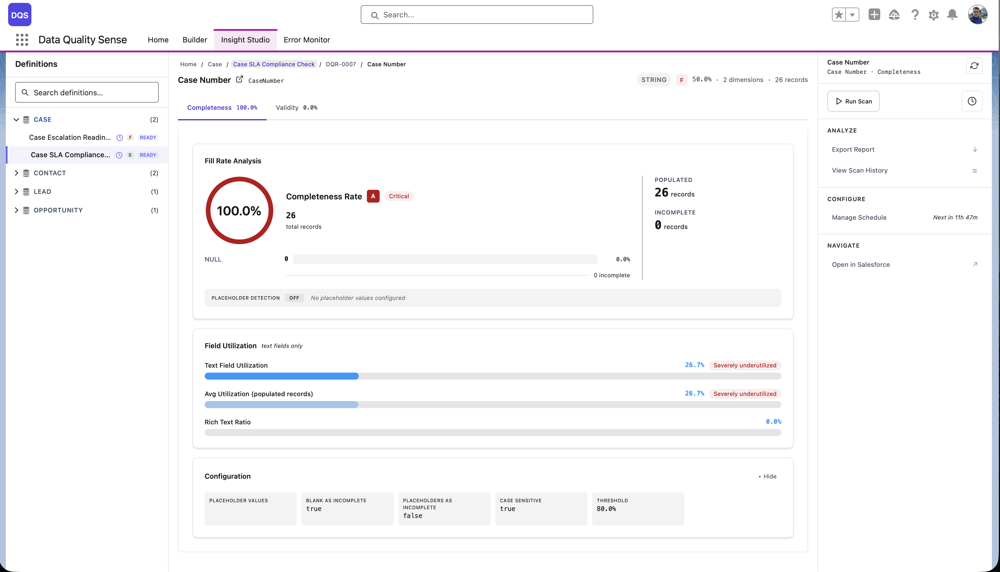
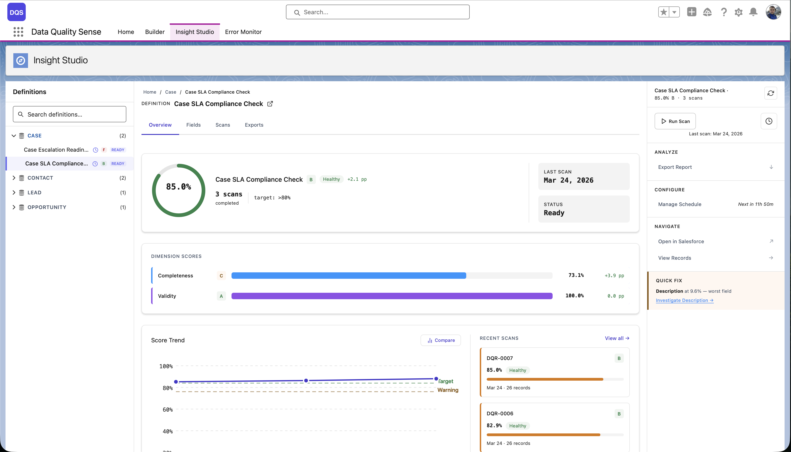
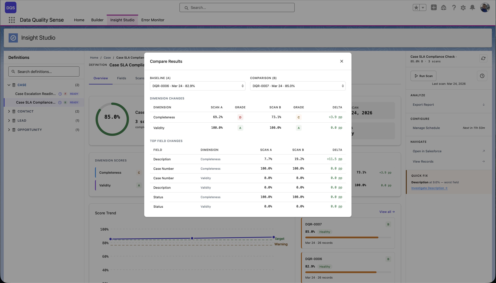

## Wyświetlanie wyników

Na każdym poziomie Insight Studio wyniki jakości są prezentowane ze wskaźnikami wizualnymi:

### Klasy wyników

| Zakres wyniku | Klasa | Kolor |
|---------------|-------|-------|
| 90–100 | Doskonały | Zielony |
| 75–89 | Dobry | Jasnozielony |
| 50–74 | Dostateczny | Żółty/Pomarańczowy |
| 25–49 | Słaby | Pomarańczowy |
| 0–24 | Krytyczny | Czerwony |

### Karty wyników

Pulpit definicji pokazuje **karty wymiarów** — po jednej dla każdej włączonej zdolności — zawierające:
- Wynik liczbowy (0–100)
- Wskaźnik klasy (kodowany kolorami)
- Strzałkę zmiany (↑ poprawa, ↓ regresja, → stabilny)
- Wykres sparkline pokazujący ostatni trend

## Analiza trendów

### Wykresy sparkline

Małe wykresy liniowe obok każdego wyniku pokazujące ostatnie kilka wyników skanów. Przydatne do wykrywania trendów bez przechodzenia do szczegółowych widoków.

### Wykres Score Trend

Większy wykres trendów dostępny na poziomie definicji pokazujący:
- Wynik w czasie dla każdego wymiaru
- Linię trendu ogólnego wyniku
- Daty skanów na osi x

### Porównanie skanów

Porównaj dwa konkretne skany, aby zobaczyć szczegółowe różnice:
- **Różnice wymiarów** — Które zdolności się poprawiły lub pogorszyły
- **Różnice pól** — Które pola się zmieniły i o ile
- Wybierz dowolne dwa skany z historii skanów

## Widoki dwustanowe

Niektóre komponenty dostosowują się w zależności od dostępności danych:
- **Brak skanów** — Wyświetla zachętę do uruchomienia pierwszego skanu
- **Dostępne wyniki** — Wyświetla pełny pulpit z wynikami i wykresami

## Podsumowanie KPI

Na górze widoku definicji wyświetlane są kluczowe wskaźniki wydajności:
- **Ogólny wynik** — Średnia ważona ze wszystkich wymiarów
- **Zeskanowane pola** — Łączna liczba uwzględnionych pól
- **Ocenione rekordy** — Łączna liczba rekordów w zakresie
- **Ostatni skan** — Znacznik czasu ostatniego skanu
