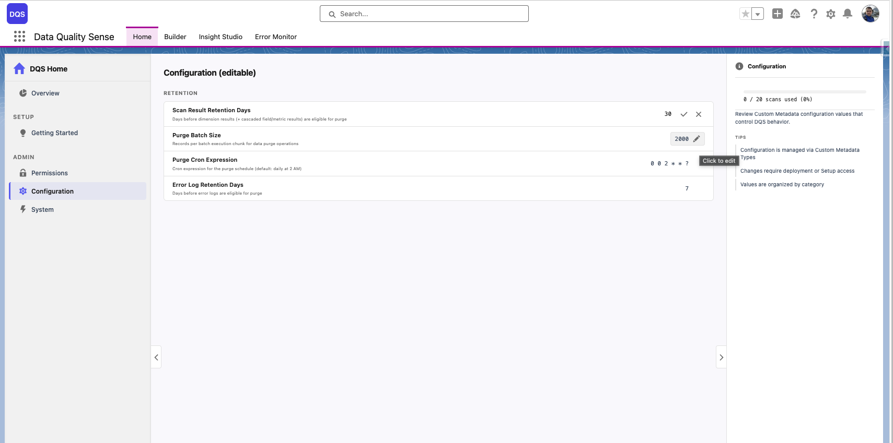

import { Aside } from '@astrojs/starlight/components';

## Polityki retencji

DQS zawiera **automatyczne usuwanie danych**, aby zapobiec nieograniczonemu wzrostowi wyników skanów i logów błędów. Polityki retencji są konfigurowane za pomocą Custom Metadata Types i mogą być dostosowywane przez administratorów.

## Konfiguracja

Wszystkie ustawienia retencji są przechowywane w `DQS_Configuration__mdt` (Kategoria: „Retention"):

| Ustawienie | Domyślnie | Opis |
|------------|-----------|------|
| **Error Log Retention** | 7 dni | Dni przed usunięciem logów błędów |
| **Scan Result Retention** | 30 dni | Dni przed usunięciem wyników wymiarów |
| **Purge Batch Size** | 2000 | Rekordy przetwarzane na fragment wsadowy |
| **Purge CRON Expression** | `0 0 2 * * ?` | Kiedy uruchamiane jest zadanie usuwania (domyślnie: codziennie o 2:00) |

<Aside type="tip">
Te ustawienia są kontrolowane przez subskrybenta — administratorzy mogą nadpisać wartości domyślne po instalacji pakietu.
</Aside>

## Jak działa usuwanie

Proces usuwania uruchamia się jako **łańcuchowe zadanie wsadowe**:

```
DQS_DataPurgeScheduler (CRON trigger)
  └── DQS_ErrorLogPurgeBatch
       (deletes error logs where Expires_At <= NOW)
       └── DQS_ResultPurgeBatch
            (deletes dimension results older than retention window)
            └── Cascade: Field Results + Metric Results
                 (deleted automatically via master-detail relationship)
```

### Usuwanie kaskadowe

Gdy rekord `DQS_Dimension_Result__c` jest usuwany:
- Wszystkie podrzędne rekordy `DQS_Field_Result__c` są automatycznie usuwane
- Wszystkie rekordy `DQS_Metric_Result__c` drugiego poziomu są automatycznie usuwane

Dzieje się to za pośrednictwem kaskady master-detail Salesforce — nie jest wymagane dodatkowe przetwarzanie wsadowe.

## Dostosowywanie retencji

Aby zmienić okresy retencji, edytuj wartości bezpośrednio w panelu **Configuration** na stronie DQS Home:



Alternatywnie możesz je zaktualizować przez Salesforce Setup:

1. Przejdź do **Setup → Custom Metadata Types → DQS Configuration**
2. Znajdź odpowiedni rekord (np. `Scan_Result_Retention_Days`)
3. Edytuj wartość
4. Zmiany zaczną obowiązywać przy następnym uruchomieniu usuwania

## Monitorowanie

- Sprawdź **konsolę zarządzania błędami** pod kątem błędów zadań usuwania
- Przejrzyj `DQS_DataPurgeScheduler` w **Setup → Scheduled Jobs**, aby zweryfikować, że usuwanie jest uruchomione
- Użyj raportów Salesforce do monitorowania objętości wyników w czasie
