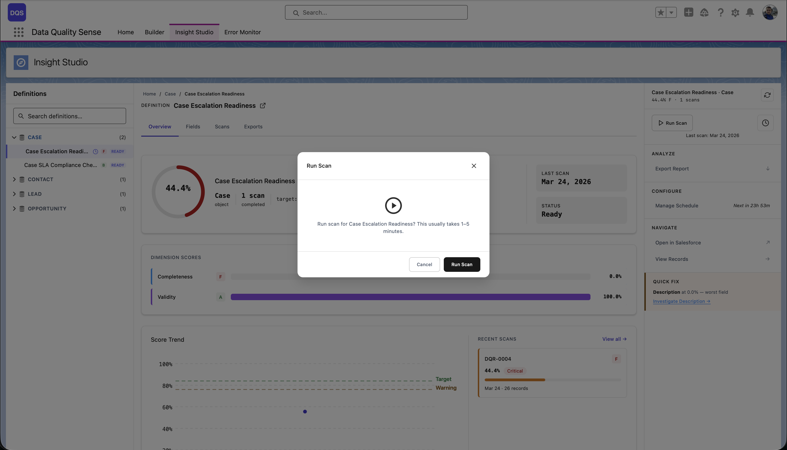

## How Scans Work

The Processing engine is the **execution layer** of Data Quality Sense. It reads scan definitions created in the Builder, queries live Salesforce data, and produces quality scores visible in Insight Studio.

## Triggering a Scan

Scans can be triggered in three ways:

1. **Manual** — Click "Run Scan" in Insight Studio
2. **Scheduled** — Via CRON-based [scheduling](/processing/scheduling/)
3. **Programmatic** — Via Apex (for custom integrations)

## Learn More

- [Scheduling](/processing/scheduling/)
- [Data Retention](/processing/data-retention/)
- [Error Management](/processing/error-management/)
