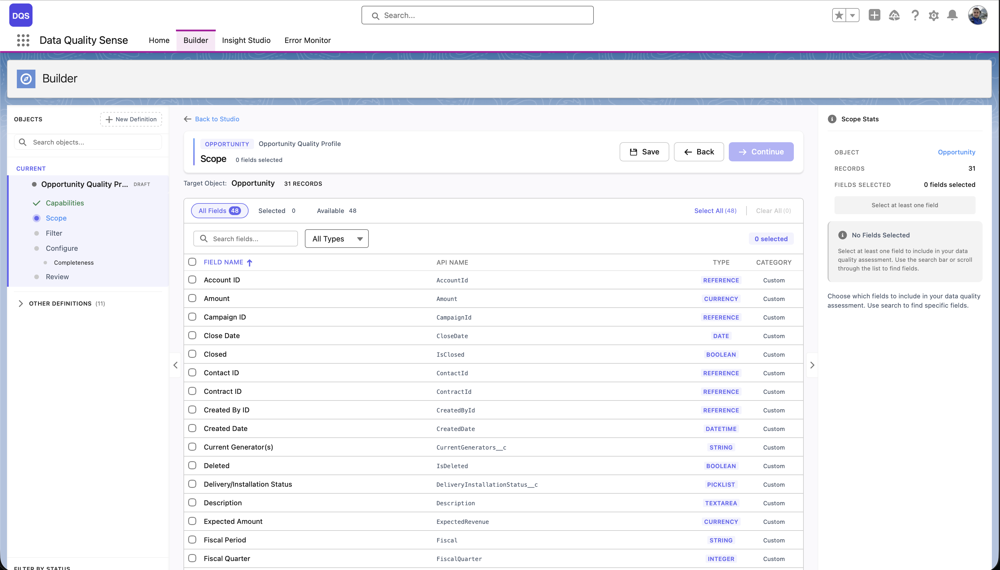
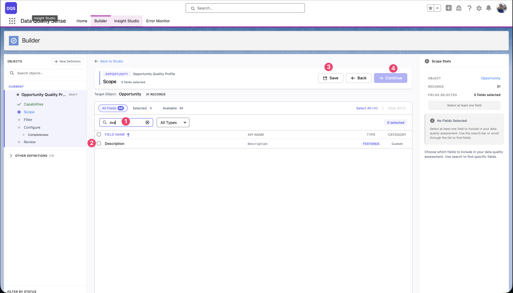
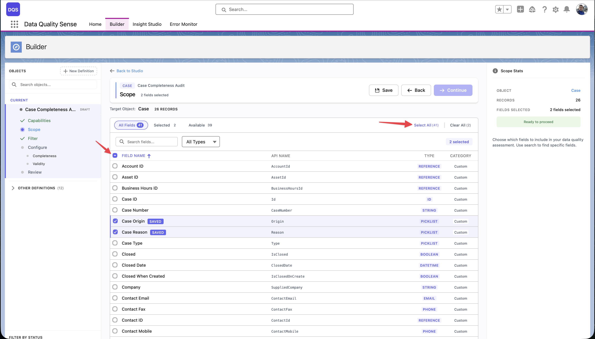
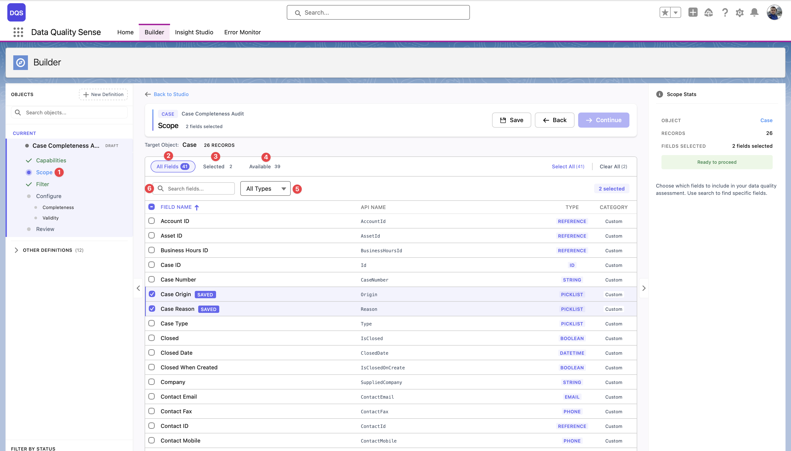

import { Aside } from '@astrojs/starlight/components';

## Seletor de Campos

O seletor de campos e a segunda etapa do assistente do Builder. Ele exibe todos os campos disponiveis no objeto selecionado em uma tabela paginada.

## Recursos

### Pesquisa e Filtro

- **Pesquisa** — Filtre campos por rotulo ou nome de API
- **Filtro por Tipo de Campo** — Mostre apenas tipos especificos de campos (Text, Number, Picklist, etc.)
- **Colunas Ordenavel** — Ordene por rotulo do campo, nome de API ou tipo de campo

### Informacoes do Campo

Para cada campo, o seletor exibe:

| Coluna | Descricao |
|--------|-----------|
| **Label** | O nome de exibicao do campo |
| **API Name** | O nome do desenvolvedor (por exemplo, `BillingCity`) |
| **Type** | Tipo de dado do campo (Text, Number, Date, Picklist, etc.) |
| **Required** | Se o campo e obrigatorio no layout |

### Selecao em Massa

Use o link **Select All** para adicionar todos os campos disponiveis ao seu escopo de uma vez — o link mostra a contagem total de campos (por exemplo, "Select All (71)"). Para remover todas as selecoes, clique em **Clear All**. A barra de cabecalho exibe contadores em tempo real para campos **Selected** e **Available** para que voce sempre saiba quantos campos estao no escopo.

As selecoes persistem entre paginas — voce pode selecionar campos na pagina 1, navegar para a pagina 2, e suas selecoes sao preservadas. O painel **Scope Stats** a direita resume sua selecao atual.

## Consideracoes sobre Campos

<Aside type="tip">
Nem todos os tipos de campos sao aplicaveis a todas as capacidades. Por exemplo, Uniqueness pode nao ser significativo para campos Boolean. O DQS lida automaticamente com combinacoes nao aplicaveis.
</Aside>

### Campos Recomendados

Para uma varredura abrangente, inclua:
- **Campos de identificacao chave** — Name, Email, Phone
- **Campos de endereco** — para Completeness e Validity
- **Campos de data** — para Timeliness
- **Campos de picklist** — para Validity e Consistency
- **Campos de texto livre** — para Completeness e PII Detection

### Campos a Evitar

- Campos gerados pelo sistema (Id, CreatedDate, LastModifiedDate) — estes estao sempre preenchidos
- Campos de formula — seus valores sao calculados, nao inseridos pelos usuarios
- Campos criptografados — podem nao ser legiveis pelo motor de varredura

## Visualizacao de Escopo

A visualizacao de Escopo e o espaco de trabalho principal para selecionar e revisar campos:

1. **Etapa Scope** — Clique na etapa **Scope** na barra lateral do assistente do Builder para carregar todos os campos do objeto de destino. E aqui que voce define quais campos serao incluidos na sua varredura de qualidade de dados.

2. **All Fields** — A visualizacao padrao mostrando todos os campos do objeto. Use esta aba para navegar pela lista completa, marcar ou desmarcar campos e ver o rotulo, nome de API, tipo e se e um campo padrao ou personalizado de cada campo. Os campos selecionados sao destacados na lista.

3. **Filtro Selected** — Mude para esta visualizacao para ver apenas os campos que voce ja adicionou ao escopo. O contador mostra quantos campos estao selecionados (por exemplo, "Selected: 2"). Use-o para revisar rapidamente suas escolhas e remover campos que voce nao precisa mais.

4. **Filtro Available** — Mostra apenas os campos que ainda nao estao no seu escopo. O contador exibe quantos restam (por exemplo, "Available: 16"). Util quando voce deseja navegar pelo que falta adicionar sem rolar pelos campos ja selecionados.

5. **Filtro de tipo** — O dropdown **All Types** permite restringir a lista de campos a um tipo de dado especifico — Text, Number, Date, Picklist, Boolean, Lookup e mais. Combine-o com os outros filtros para encontrar rapidamente os campos exatos que voce precisa (por exemplo, mostrar apenas campos Picklist disponiveis).

O painel **Scope Stats** a direita resume sua selecao com uma contagem de campos e mostra um indicador **Ready to proceed** quando pelo menos um campo esta selecionado.

