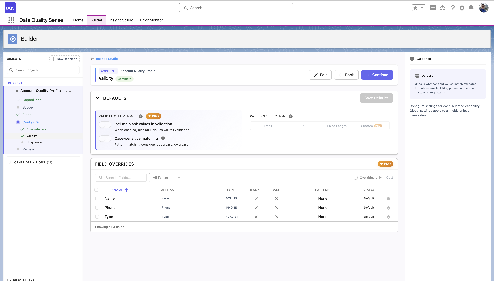
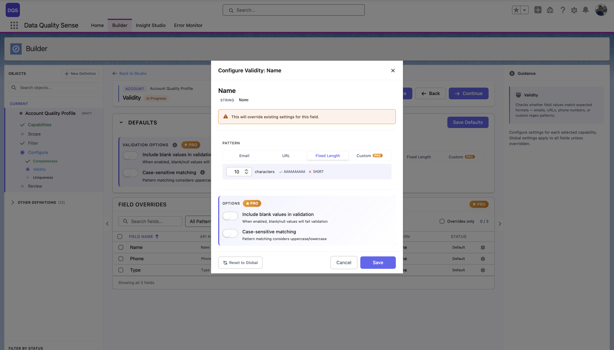
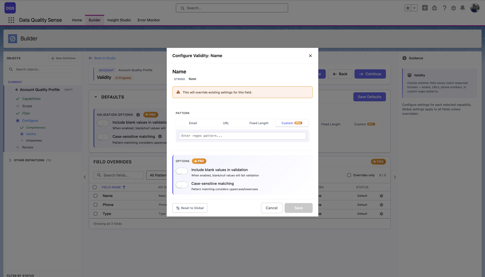

## O que e Validity?

Validity mede se os valores dos campos **estao em conformidade com formatos, intervalos e padroes esperados**. Um campo pode estar preenchido (completo) mas ainda conter dados invalidos — Validity detecta esses problemas.

## Como Funciona

A estrategia de Validity avalia cada valor de campo contra regras esperadas:

1. **Campos de picklist** — Verifica se os valores correspondem aos valores de picklist definidos (incluindo metadados e valores ativos)
2. **Campos de texto** — Valida contra padroes de formato (por exemplo, formato de e-mail, formato de telefone)
3. **Campos numericos** — Valida contra intervalos esperados
4. **Campos de data** — Verifica intervalos de data razoaveis

## Configuracao

### Configuracoes Globais

A secao **Defaults** controla as opcoes globais de validacao que se aplicam a todos os campos:

| Configuracao | Descricao |
|--------------|-----------|
| **Include blank values in validation** | Quando habilitado, valores em branco/nulos falharao na validacao |
| **Case-sensitive matching** | A correspondencia de padroes considera maiusculas/minusculas |
| **Pattern Selection** | Escolha um padrao de validacao padrao (Email, URL, Fixed Length ou regex personalizado) |

A tabela **Field Overrides** abaixo lista cada campo no escopo com seu padrao e status atuais. Campos marcados como "Default" usam as configuracoes globais, "None" significa que nenhum padrao foi atribuido ainda.

### Substituicoes por Campo

Clique em um campo na tabela Field Overrides para abrir seu modal de configuracao. Aqui voce pode atribuir um padrao de validacao especifico para aquele campo — escolha entre padroes predefinidos (Email, URL, Fixed Length) ou selecione **Custom** para inserir seu proprio regex. Cada substituicao de campo tambem permite alternar **Include blank values** e **Case-sensitive matching** independentemente dos padroes globais. Use o link **Revert to Global** para redefinir o campo de volta as configuracoes globais.

## Pontuacao

| Resultado | Pontuacao |
|-----------|-----------|
| Todos os valores validos | 100 |
| Alguns invalidos | Proporcional a porcentagem de validos |
| Todos invalidos | 0 |
| Sem dados | 0 |

## Padroes Regex

O DQS usa **expressoes regulares compativeis com Java** para validacao de campos de texto. Quando voce seleciona **Custom** no seletor de padroes, um campo de texto aparece onde voce pode inserir seu proprio padrao regex.

Consulte o [Testador de Regex](/pt/reference/regex-tester/) para um testador interativo e uma biblioteca de padroes prontos para uso para e-mail, telefone, URL, codigos postais e mais.

## Casos de Uso

- Garantir que campos de e-mail contenham enderecos de e-mail formatados corretamente
- Verificar se campos de picklist contem apenas valores aprovados
- Detectar entradas de texto livre em campos que deveriam usar vocabularios controlados
- Validar formatos de numeros de telefone entre regioes
