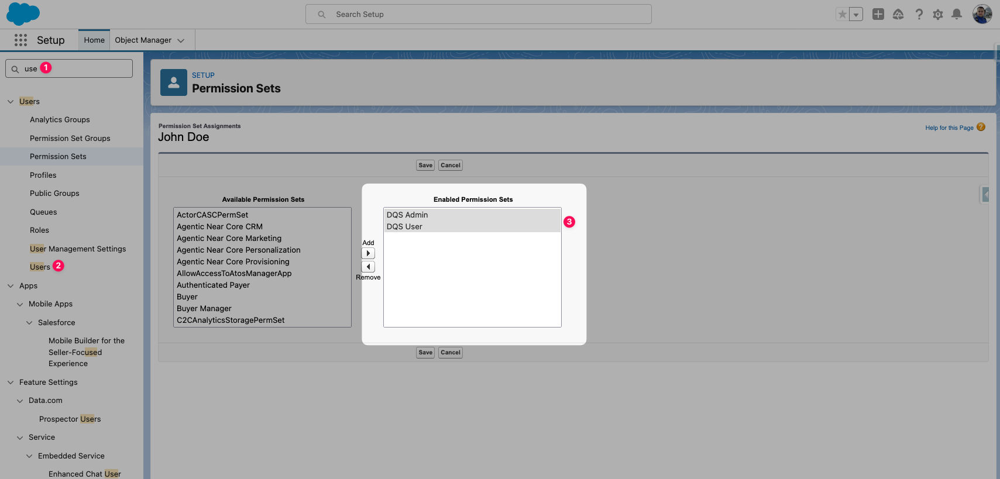

import { Aside } from '@astrojs/starlight/components';

## Permission Sets

O Data Quality Sense inclui permission sets que controlam o acesso a diferentes partes do aplicativo.

### DQS Admin

Acesso completo a todos os recursos:
- Criar, editar e excluir definicoes de varredura
- Configurar capacidades e limites
- Executar e agendar varreduras
- Visualizar todos os resultados no Insight Studio
- Acessar o Console de Gerenciamento de Erros
- Gerenciar configuracoes de retencao de dados

### DQS User

Acesso somente leitura aos resultados:
- Visualizar resultados de varredura no Insight Studio
- Exportar dados para CSV
- Visualizar agendamentos de varredura

## Atribuindo Permission Sets

1. Navegue ate **Setup → Users → Permission Set Assignments** para o usuario desejado
2. Clique em **Edit Assignments**
3. Na lista **Available Permission Sets**, encontre **DQS Admin** ou **DQS User**
4. Mova o permission set desejado para **Enabled Permission Sets** usando o botao de seta
5. Clique em **Save**

<Aside type="caution">
Usuarios sem nenhum permission set DQS atribuido verao um portal de ativacao ao acessar o aplicativo. A aba Getting Started aparecera automaticamente para guiar os administradores pelo processo de configuracao.
</Aside>

## Permissoes de Objetos

Os permission sets concedem automaticamente acesso aos objetos personalizados do DQS:

| Objeto | Admin | User |
|--------|-------|------|
| `DQS_Definition__c` | Read/Create/Edit/Delete | Read |
| `DQS_Definition_Detail__c` | Read/Create/Edit/Delete | Read |
| `DQS_Dimension_Result__c` | Read | Read |
| `DQS_Field_Result__c` | Read | Read |
| `DQS_Metric_Result__c` | Read | Read |
| `DQS_Batch_Schedule__c` | Read/Create/Edit/Delete | Read |

## Seguranca em Nivel de Campo

Todos os campos nos objetos DQS sao visiveis para ambos os permission sets. Resultados de metricas, pontuacoes e campos de configuracao sao somente leitura para DQS User.
