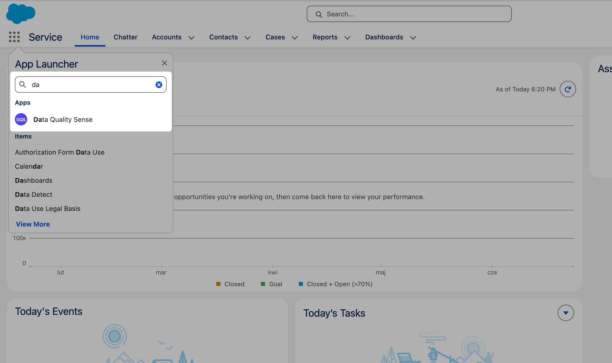
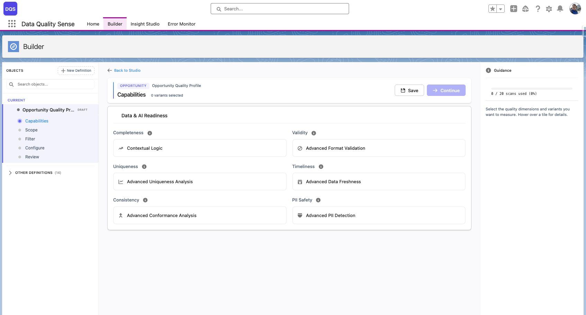
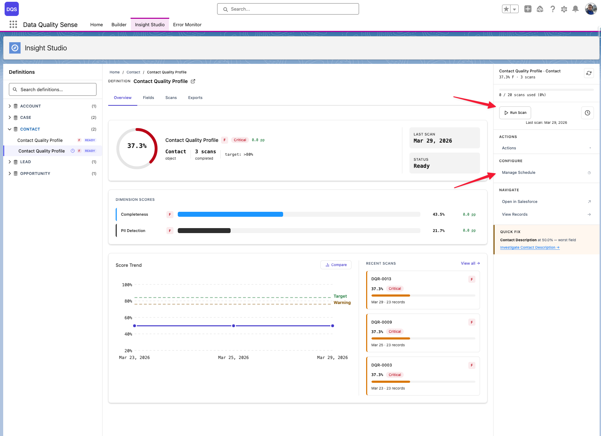
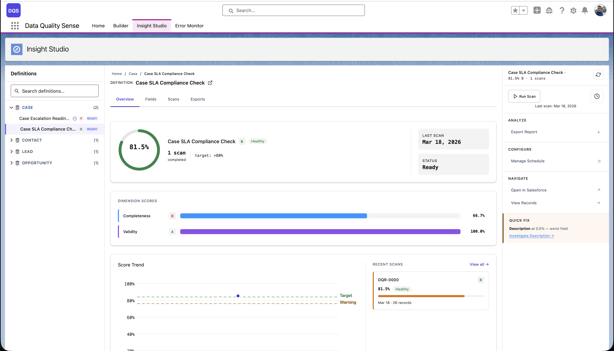

import { Aside } from '@astrojs/starlight/components';

## Sua Primeira Varredura em 5 Minutos

1. **Abra o DQS Builder**

   Navegue ate o aplicativo **Data Quality Sense** no Salesforce. Se as permissoes estiverem configuradas corretamente, a aba Builder carrega automaticamente.

2. **Crie uma nova definicao**

   Clique em **New Definition**. De um nome (por exemplo, "Account Quality Check") e selecione o objeto de destino — por exemplo, `Account`.

   <video src="/videos/definition-creation.mp4" controls muted loop style="width:100%;border-radius:0.5rem;border:1px solid var(--sl-color-hairline-light)">Seu navegador nao suporta a tag de video.</video>

3. **Selecione os campos**

   O seletor de campos mostra todos os campos disponiveis no objeto selecionado. Escolha os campos que voce deseja monitorar. Voce pode usar a barra de pesquisa para filtrar e ordenar por tipo de campo ou rotulo.

4. **Escolha as capacidades**

   Selecione quais dimensoes de qualidade avaliar:
   - **Completeness** — os campos estao preenchidos?
   - **Validity** — os valores correspondem aos formatos esperados?
   - **Uniqueness** — existem valores duplicados?
   - **Timeliness** — os dados estao atualizados?
   - **Consistency** — os campos relacionados sao logicamente consistentes?
   - **PII Detection** — o texto livre contem informacoes de identificacao pessoal?

   Comece com Completeness para a configuracao mais rapida.

   

5. **Revise e ative**

   Revise sua configuracao na tela de resumo. Clique em **Activate** para mover a definicao de Draft para o status Active.

6. **Execute a varredura**

   Va ate o **Insight Studio** e acione uma varredura manualmente, ou configure um [agendamento](/pt/processing/scheduling/).

   

7. **Visualize os resultados**

   Apos a conclusao da varredura, o Insight Studio mostra suas pontuacoes de qualidade de dados com detalhamento em nivel de campo.

<Aside type="tip">
Voce sempre pode voltar e adicionar mais capacidades ou campos a sua definicao posteriormente. O Builder suporta a edicao de definicoes Active.
</Aside>

## Proximos Passos

- Conheca todas as [6 capacidades de qualidade](/pt/capabilities/overview/)
- Explore os [paineis do Insight Studio](/pt/insight-studio/overview/)
- Configure [agendamentos automaticos de varredura](/pt/processing/scheduling/)
