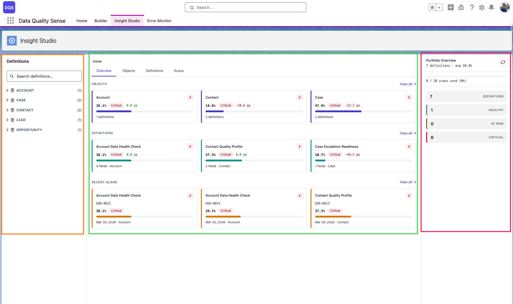

import { Card, CardGrid } from '@astrojs/starlight/components';

## O que e o Insight Studio?

O Insight Studio (DIS) e a **camada de visualizacao e analise** do Data Quality Sense. Ele consome resultados de varredura e os apresenta como paineis interativos, graficos e recomendacoes.

## Layout do Espaco de Trabalho

O Insight Studio utiliza um **layout de 3 zonas**:

- **Barra lateral** (laranja) — Navegacao por objeto/definicao, filtros e opcoes de detalhamento
- **Palco** (verde) — Area de conteudo principal com pontuacoes, graficos e tabelas de dados
- **Visao geral do portfolio** (vermelho) — Metricas resumidas, links rapidos e acoes contextuais

<CardGrid>
	<Card title="Visao Geral de Pontuacao" icon="open-book">
		Pontuacoes de qualidade resumidas para cada dimensao, com classificacoes gerais e indicadores de nota.
	</Card>
	<Card title="Analise de Tendencias" icon="open-book">
		Sparklines e graficos de tendencia mostrando como a qualidade dos dados muda ao longo do tempo entre varreduras.
	</Card>
	<Card title="Saude dos Campos" icon="open-book">
		Visualizacao em matriz da pontuacao de qualidade de cada campo por dimensao. Identifique rapidamente os campos mais fracos.
	</Card>
	<Card title="AI Mentor" icon="open-book">
		Recomendacoes contextuais baseadas nos resultados da varredura. Sugere acoes para melhorar a qualidade dos dados.
	</Card>
</CardGrid>

## Recursos Principais

| Recurso | Descricao |
|---------|-----------|
| **Navegacao multinivel** | Navegue de Home → Object → Definition → Scan → Field → Dimension |
| **Comparacao de pontuacoes** | Compare resultados entre duas varreduras para ver melhoria ou regressao |
| **Menu de acoes** | Crie Tasks, publique no Chatter ou exporte CSV para registros afetados |
| **Acionamento de varredura** | Acione uma varredura manualmente a partir do painel |
| **Gerenciamento de agendamentos** | Crie e gerencie agendamentos de varredura |

## Saiba Mais

- [Navegacao](/pt/insight-studio/navigation/)
- [Pontuacoes e Tendencias](/pt/insight-studio/scores-trends/)
- [Saude dos Campos](/pt/insight-studio/field-health/)
- [Acoes](/pt/insight-studio/actions/)
- [Exportacoes](/pt/insight-studio/exports/)
